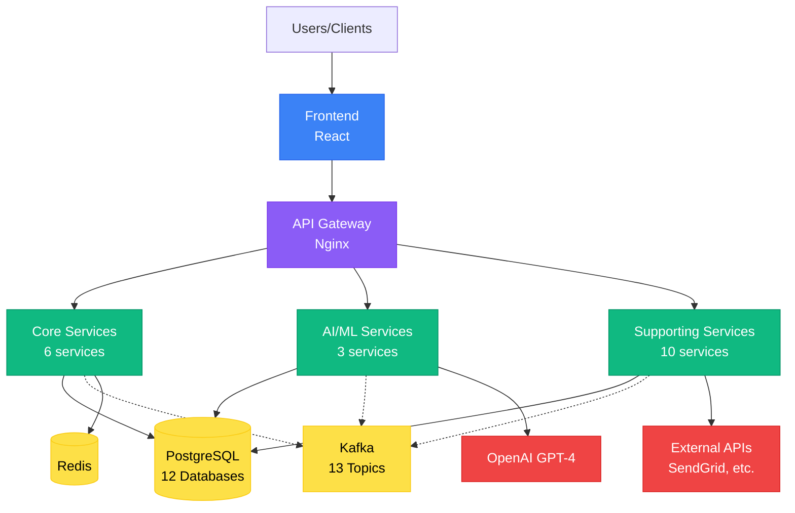
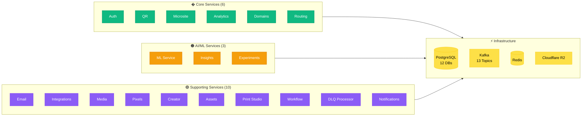
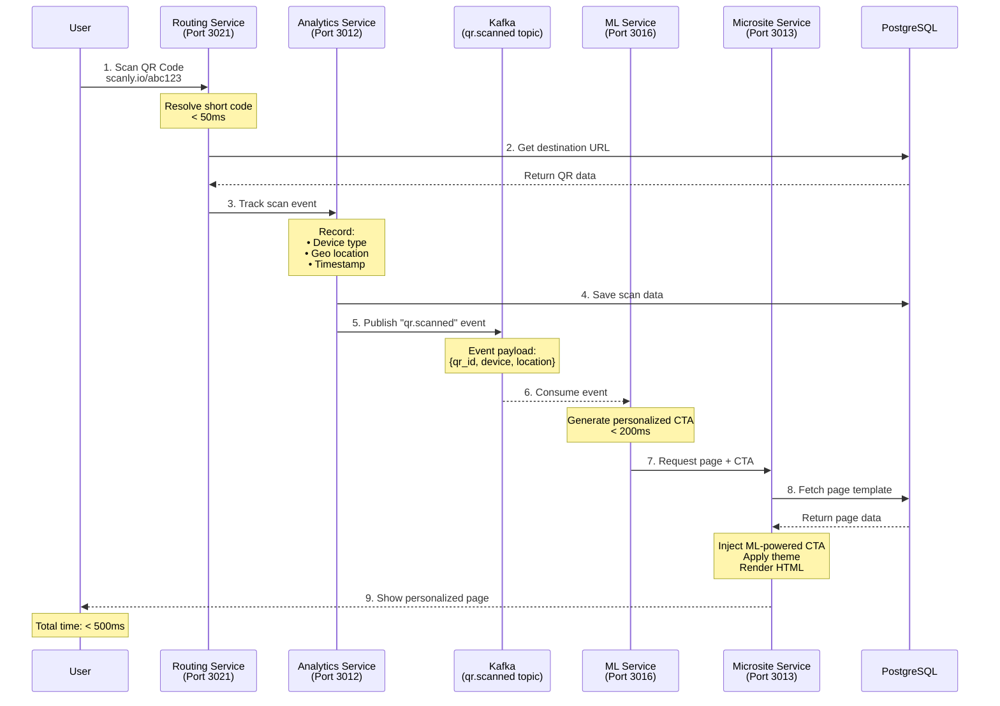
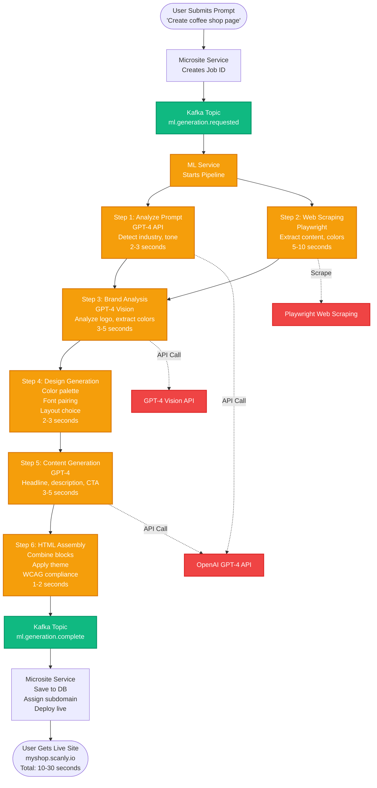
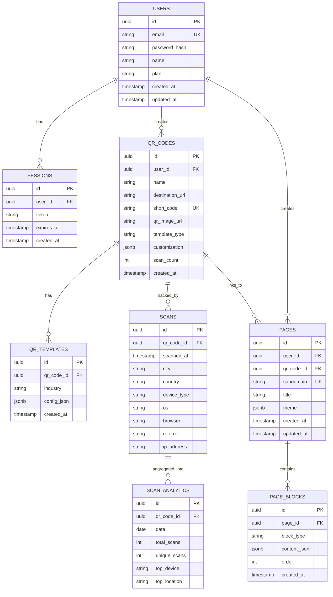
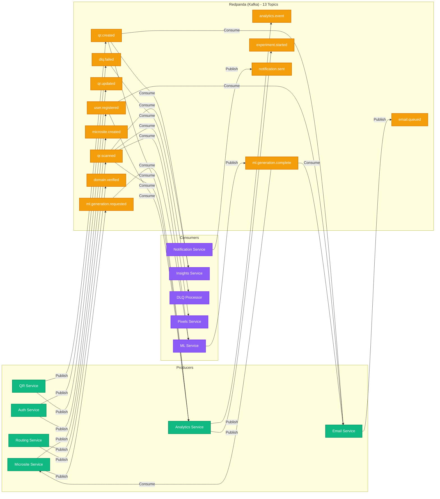
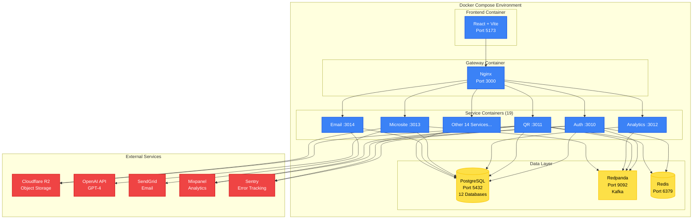

# 🏗️ Architecture Diagrams (Mermaid)

**Auto-renders in GitHub, VS Code, and most Markdown viewers!**

---

## 📊 Diagram 1: Simplified Architecture Overview



---

## 📊 Diagram 1b: Detailed Service Breakdown



---

## 📊 Diagram 2: QR Scan Flow (Real-Time Event Processing)



---

## 📊 Diagram 3: AI Microsite Generation Pipeline



---

## 📊 Diagram 4: Database Schema (Multi-Database Strategy)



---

## 📊 Diagram 5: Kafka Event Architecture



---

## 📊 Diagram 6: Deployment Architecture (Docker Compose)



---

## 🎯 How to Use These Diagrams

### **In GitHub:**
1. Push this file to your repo
2. GitHub automatically renders Mermaid diagrams
3. View in your README or documentation

### **In VS Code:**
1. Install "Markdown Preview Mermaid Support" extension
2. Open this file
3. Click "Preview" to see rendered diagrams

### **In Presentations:**
1. Use GitHub's rendered view
2. Take screenshots
3. Or export to PDF

### **For LinkedIn:**
1. View diagram in GitHub
2. Take high-quality screenshot
3. Upload to LinkedIn Featured section

---

## 📝 LinkedIn Description

Use this with your diagram screenshots:

```
Architecture Overview: QR & Microsite Platform

Designed and implemented a scalable, event-driven microservices architecture:

🏗️ Architecture:
• 19 microservices (Node.js + TypeScript)
• Multi-database strategy (12 PostgreSQL databases)
• Event-driven communication (Kafka, 13 topics)
• Multi-tenant with custom domain support

🤖 AI/ML Integration:
• OpenAI GPT-4 for AI-powered microsite generation
• Personalized CTAs (6 persuasion types)
• WCAG/ADA compliance automation

📊 Real-Time Analytics:
• Device tracking, geo-location
• Funnel analysis, conversion tracking
• 47+ tracked events (Mixpanel)

🔧 Tech Stack:
• Node.js, TypeScript, PostgreSQL (Drizzle ORM)
• Kafka (Redpanda), Redis, Docker
• OpenAI API, Cloudflare R2
• Mixpanel, Sentry

Built during career transition period (Aug 2025 - Jan 2026).
Currently validating business model with beta users.

#Architecture #Microservices #NodeJS #AI #SaaS
```

---

## 🚀 Next Steps

1. ✅ **Push to GitHub** - Diagrams auto-render
2. ✅ **Add to README** - Showcase your architecture
3. ✅ **Screenshot for LinkedIn** - Visual portfolio
4. ✅ **Use in interviews** - Technical talking points
5. ✅ **Create presentation** - Export diagrams

**Your architecture is now beautifully documented and shareable!** 🎉
