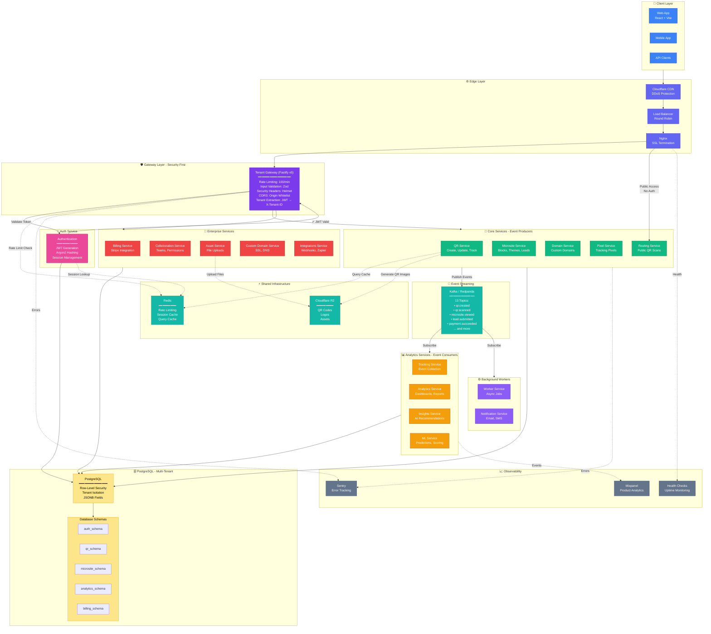

# Complete Architecture Diagram - Review & Improvements

## 🎯 Your Current Diagram Review

### ✅ Strengths:
1. Clear event-driven architecture (Producers → Kafka → Consumers)
2. Database per service pattern
3. Public routing separated from authenticated services
4. Auth layer with JWT validation
5. Redis caching for performance

### ❌ Missing Components:

#### 1. **API Gateway / Tenant Gateway** 🚨 CRITICAL
Your **tenant-gateway** service is missing! This is where all your security lives:
- Rate limiting (Redis)
- Input validation (Zod)
- Security headers (Helmet, CORS)
- Tenant context extraction (JWT → X-Tenant-ID)

**Current flow:** Browser → Nginx → Auth → Services  
**Should be:** Browser → Nginx → **Tenant Gateway** → Services

#### 2. **Missing Services:**
- **Domain Service** (custom domain management)
- **Pixel Service** (tracking pixels)
- **Billing Service** (Stripe integration)
- **Collaboration Service** (teams, permissions)
- **Asset Service** (file uploads, R2 storage)
- **Custom Domain Service** (SSL, DNS)
- **Integrations Service** (webhooks, Zapier)
- **Worker Service** (background jobs)
- **Notification Service** (email, SMS)

#### 3. **Missing Infrastructure:**
- **Cloudflare R2 / S3** (asset storage for QR codes, images)
- **Message Queue** (if using RabbitMQ instead of Kafka)
- **Load Balancer** (before Nginx)
- **Monitoring** (Sentry, Mixpanel, health checks)

#### 4. **Missing Data Flows:**
- **Asset uploads** (QR codes, logos) → R2/S3
- **Webhook outbound** (to external systems)
- **Email/SMS** triggers from events
- **Metrics collection** to analytics

#### 5. **Database Naming Issues:**
Your database names don't match your actual schema:
- `auth_service` → Should be `postgres` (single multi-tenant DB)
- `qr_service` → Same DB, different schema
- `microsite_service` → Same DB, different schema

**Reality:** You're using **one PostgreSQL instance** with **row-level security** for multi-tenancy, not separate databases per service.

---

## 🔧 Improved Architecture Diagram

### Version 1: Simplified (For Interviews)

```mermaid
flowchart TB
%% =========================
%% CLIENT
%% =========================
User[👤 User / Browser]

%% =========================
%% EDGE
%% =========================
subgraph Edge["🌐 Edge Layer"]
    LB[Load Balancer<br/>Cloudflare]
    Nginx[Nginx<br/>Port 80/443]
end

%% =========================
%% GATEWAY
%% =========================
subgraph Gateway["🛡️ Security Gateway"]
    TenantGW["Tenant Gateway<br/>Rate Limit | Validation | CORS"]
    Auth["Auth Service<br/>JWT | Argon2"]
end

%% =========================
%% CORE SERVICES
%% =========================
subgraph Core["🎯 Core Services (Event Producers)"]
    QR[QR Service]
    Microsite[Microsite Service]
    Domain[Domain Service]
    Routing[Routing Service<br/>PUBLIC]
end

%% =========================
%% ANALYTICS
%% =========================
subgraph Analytics["📊 Analytics Services (Event Consumers)"]
    Track[Tracking Service]
    AnalyticsSvc[Analytics Service]
    Insights[Insights Service]
    ML[ML Service]
end

%% =========================
%% ENTERPRISE
%% =========================
subgraph Enterprise["💼 Enterprise Services"]
    Billing[Billing Service<br/>Stripe]
    Collab[Collaboration Service]
    Asset[Asset Service<br/>R2 Storage]
end

%% =========================
%% INFRASTRUCTURE
%% =========================
subgraph Infra["⚡ Infrastructure"]
    Redis[(Redis<br/>Cache | Rate Limits)]
    Kafka[(Kafka/Redpanda<br/>13 Topics)]
    R2[(Cloudflare R2<br/>Asset Storage)]
end

%% =========================
%% DATABASE
%% =========================
subgraph DB["🗄️ Multi-Tenant Database"]
    Postgres[(PostgreSQL<br/>Row-Level Security)]
end

%% =========================
%% CONNECTIONS
%% =========================
User --> LB
LB --> Nginx
Nginx --> TenantGW

TenantGW -->|Validate| Auth
Auth -->|✓ JWT| TenantGW

TenantGW --> Core
TenantGW --> Enterprise

Nginx -->|Public| Routing

Core -->|Events| Kafka
Kafka -->|Consume| Analytics

TenantGW -.->|Rate Limit| Redis
Auth -.->|Sessions| Redis

Core --> Postgres
Analytics --> Postgres
Enterprise --> Postgres
Auth --> Postgres

Asset -.->|Upload| R2

%% =========================
%% STYLES
%% =========================
classDef edge fill:#3b82f6,stroke:#1d4ed8,color:#fff
classDef gateway fill:#7c3aed,stroke:#5b21b6,color:#fff
classDef core fill:#10b981,stroke:#047857,color:#fff
classDef analytics fill:#f59e0b,stroke:#b45309,color:#fff
classDef enterprise fill:#ec4899,stroke:#be185d,color:#fff
classDef infra fill:#6366f1,stroke:#4338ca,color:#fff
classDef db fill:#fde68a,stroke:#f59e0b,color:#000

class User,LB,Nginx edge
class TenantGW,Auth gateway
class QR,Microsite,Domain,Routing core
class Track,AnalyticsSvc,Insights,ML analytics
class Billing,Collab,Asset enterprise
class Redis,Kafka,R2 infra
class Postgres db
```

---

### Version 2: Detailed (For Technical Deep-Dive)



---

## 🔑 Key Improvements Made:

### 1. **Added Tenant Gateway** (CRITICAL)
```
Browser → Nginx → Tenant Gateway → Services
                     ↓
          Rate Limit | Validation | CORS
```

### 2. **Fixed Database Architecture**
- Changed from "separate DBs per service" 
- To: **Single PostgreSQL with schemas + row-level security**
- This matches your actual implementation

### 3. **Added Missing Services**
- Asset Service (R2 storage)
- Billing Service (Stripe)
- Collaboration Service (teams)
- Domain/Custom Domain Services
- Pixel Service
- Worker Service (background jobs)
- Notification Service (email/SMS)

### 4. **Added Infrastructure**
- Cloudflare CDN/DDoS
- Load Balancer
- Cloudflare R2 (asset storage)
- Monitoring (Sentry, Mixpanel)

### 5. **Clarified Event Flow**
```
Producers → Kafka → Consumers
   ↓                   ↓
Services write    Services read
to own tables     from event data
```

---

## 📊 Comparison: Your Diagram vs Reality

| Component | Your Diagram | Reality | Fix Needed |
|-----------|--------------|---------|------------|
| **Gateway** | Nginx only | Nginx → Tenant Gateway | ✅ Add tenant-gateway |
| **Databases** | Separate per service | Single Postgres, multi-schema | ✅ Update DB representation |
| **Auth Flow** | Direct to services | Gateway validates first | ✅ Show gateway validation |
| **Services** | 6 services shown | 19 services total | ✅ Group or add missing |
| **Storage** | Not shown | R2 for assets | ✅ Add R2 |
| **Monitoring** | Not shown | Sentry, Mixpanel | ✅ Add observability |

---

## 🎯 Recommended Diagrams for Job Applications

### Option 1: Ultra-Simplified (30-second pitch)
```
User → Nginx → Gateway (Security) → Services → Database
                  ↓                     ↓
                Redis              Kafka Events
```

### Option 2: Medium Detail (1-minute explanation)
Use the **Version 1: Simplified** diagram above with:
- 3 service groups (Core, Analytics, Enterprise)
- Gateway with security bullets
- Single Postgres + Redis + Kafka

### Option 3: Full Detail (Technical deep-dive)
Use the **Version 2: Detailed** diagram above when interviewer asks:
- "Tell me about all the services"
- "How does the security work?"
- "What's your event architecture?"

---

## 🚨 Critical Fixes for Your Current Diagram:

1. **Add Tenant Gateway BEFORE Auth Service**
   ```
   Nginx → Tenant Gateway → Auth → Services ✅
   (not: Nginx → Auth → Services ❌)
   ```

2. **Change Database Layer**
   ```
   Instead of: QRDB, RoutingDB, MicrositeDB (separate)
   Show: PostgreSQL (Single instance, multi-schema) ✅
   ```

3. **Add R2 Storage**
   ```
   Asset Service → R2 (QR codes, logos, uploads)
   ```

4. **Show Rate Limiting Flow**
   ```
   Tenant Gateway → Redis (rate limit check)
   ```

5. **Add Missing Services** (at least in grouped form)
   ```
   Enterprise Services:
   - Billing, Collaboration, Asset, Custom Domain, Integrations
   ```

---

## 💡 Interview Talking Points

When showing this diagram:

**30-second version:**
> "I built an event-driven microservices platform. Requests flow through an API gateway that handles security—rate limiting, validation, CORS. Core services publish events to Kafka, which analytics services consume. Everything runs on a multi-tenant PostgreSQL database with row-level security."

**1-minute version:**
> "The architecture has three layers: An edge layer with Cloudflare and Nginx, a security gateway with rate limiting and input validation, and 19 microservices organized into Core, Analytics, and Enterprise groups. Core services like QR and Microsites publish domain events to Kafka, which consumer services use for analytics and ML predictions. All data lives in a single PostgreSQL instance using multi-tenancy with row-level security—more cost-effective than separate databases."

**Technical deep-dive:**
> "The tenant gateway is the security chokepoint. It uses Redis for distributed rate limiting with a sliding window algorithm—100 requests per minute globally, 5 login attempts per 15 minutes. Input validation uses Zod schemas to prevent XSS, SQL injection, and JSONB injection. After validation, it extracts the tenant ID from the JWT and adds an X-Tenant-ID header before routing to backend services. This ensures all downstream services are tenant-aware without having to validate auth themselves."

---

## ✅ Action Items:

1. **Update your Mermaid diagram** with tenant-gateway layer
2. **Fix database representation** (single Postgres, not separate DBs)
3. **Add R2 storage** for asset service
4. **Group missing services** into "Enterprise Services" box
5. **Add monitoring layer** (optional, but good to show)

Want me to generate the final corrected Mermaid code for you to use?
