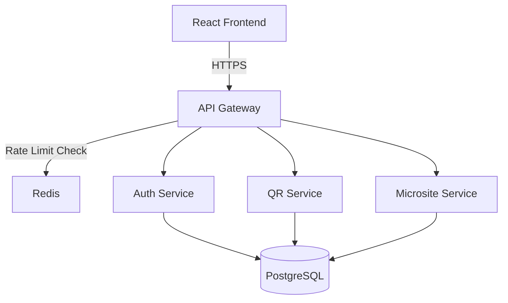

# Architecture Diagrams - Interview Guide

## 🎯 Phase 1: Simplified View (For Job Applications)

**Use this for:** Resume, LinkedIn, initial interviews

### Simple 3-Tier Architecture

```
┌─────────────────────────────────────────────────────────────┐
│                    FRONTEND LAYER                           │
│  React + Vite + TypeScript + shadcn/ui                      │
│  • QR Code Builder                                          │
│  • Microsite Designer (Drag & Drop)                         │
│  • Analytics Dashboard                                      │
│  • Real-time Preview                                        │
└──────────────────────┬──────────────────────────────────────┘
                       │ HTTPS/SSL
                       │ Authentication (JWT)
┌──────────────────────▼──────────────────────────────────────┐
│                   API GATEWAY LAYER                         │
│  Fastify v5 + Security Middleware                           │
│  • Rate Limiting (Redis)           100 req/min              │
│  • Input Validation (Zod)          50+ schemas              │
│  • Security Headers (Helmet)       CSP, CORS, HSTS          │
│  • Request Routing                 Multi-tenant aware       │
└──────────────────────┬──────────────────────────────────────┘
                       │
        ┌──────────────┼──────────────┐
        │              │              │
┌───────▼──────┐  ┌───▼────────┐  ┌──▼──────────┐
│ Auth Service │  │ QR Service │  │ Microsite   │
│              │  │            │  │ Service     │
│ • Signup     │  │ • Create   │  │ • Blocks    │
│ • Login      │  │ • Track    │  │ • Themes    │
│ • JWT        │  │ • Analytics│  │ • Leads     │
│ • Argon2     │  │ • Domains  │  │ • Public    │
└───────┬──────┘  └───┬────────┘  └──┬──────────┘
        │             │              │
        └─────────────┼──────────────┘
                      │
         ┌────────────▼─────────────┐
         │   PostgreSQL Database    │
         │   Multi-tenant Schema    │
         │   • Row-level security   │
         │   • JSONB for flexibility│
         └──────────────────────────┘

         ┌──────────────────────────┐
         │   Redis Cache Layer      │
         │   • Rate limiting        │
         │   • Session management   │
         └──────────────────────────┘
```

**Talking Points:**
- "3-tier architecture: Frontend, Gateway, Backend Services"
- "API Gateway handles all security: rate limiting, validation, CORS"
- "Microservices for each domain: Auth, QR, Microsites"
- "PostgreSQL with multi-tenant row-level security"
- "Redis for distributed rate limiting"

---

## 🔧 Phase 2: Technical Deep-Dive (For Interviews)

**Use this for:** Technical interviews, architecture discussions

### Grouped Services Architecture

```
┌─────────────────────────────────────────────────────────────┐
│                        FRONTEND                             │
│  React SPA (Vite) + React Router + TanStack Query           │
└──────────────────────┬──────────────────────────────────────┘
                       │
┌──────────────────────▼──────────────────────────────────────┐
│                   TENANT GATEWAY                            │
│  • Security Layer (Helmet, CORS, Rate Limits)               │
│  • Input Validation (Zod schemas)                           │
│  • Tenant Context Extraction (JWT → X-Tenant-ID)            │
│  • Service Mesh Routing                                     │
└──────────────────────┬──────────────────────────────────────┘
                       │
        ┌──────────────┼──────────────┬──────────────┐
        │              │              │              │
┌───────▼──────┐  ┌───▼────────┐  ┌──▼──────────┐  │
│ CORE         │  │ ANALYTICS  │  │ ENTERPRISE  │  │
│ SERVICES     │  │ SERVICES   │  │ SERVICES    │  │
│              │  │            │  │             │  │
│ • Auth       │  │ • Tracking │  │ • Billing   │  │
│ • QR Codes   │  │ • Events   │  │ • Teams     │  │
│ • Microsites │  │ • Insights │  │ • Assets    │  │
│ • Domains    │  │ • Reports  │  │ • Custom    │  │
│ • Pixels     │  │ • ML       │  │   Domains   │  │
└───────┬──────┘  └───┬────────┘  └──┬──────────┘  │
        │             │              │              │
        └─────────────┴──────────────┴──────────────┘
                      │
         ┌────────────▼─────────────┐
         │   DATA LAYER             │
         │   • PostgreSQL (Primary) │
         │   • Redis (Cache/Queue)  │
         │   • R2/S3 (Assets)       │
         └──────────────────────────┘
```

**Talking Points:**
- "Microservices grouped by domain: Core, Analytics, Enterprise"
- "API Gateway extracts tenant context from JWT → X-Tenant-ID header"
- "Services are stateless, can scale horizontally"
- "Redis for distributed rate limiting and caching"
- "Cloudflare R2 for asset storage (QR codes, images)"

---

## 📊 Phase 3: Full System (Only if Asked)

**Use this for:** "Tell me about ALL the services" questions

### Complete Microservices Map

```
FRONTEND TIER
├── React SPA (Vite + TypeScript)
│
API GATEWAY TIER
├── Tenant Gateway (Fastify)
│   ├── Rate Limiting Middleware
│   ├── Input Validation (Zod)
│   ├── Security Headers (Helmet)
│   └── Service Router
│
CORE SERVICES (5)
├── auth-service          → User authentication, JWT, sessions
├── qr-service           → QR code CRUD, generation, tracking
├── microsite-service    → Microsite builder, blocks, themes
├── domain-service       → Custom domain management
└── pixel-service        → Tracking pixels, retargeting
│
ANALYTICS SERVICES (4)
├── tracking-service     → Event collection, scan logging
├── analytics-service    → Aggregation, dashboards
├── insights-service     → AI-powered recommendations
└── ml-service          → Machine learning predictions
│
ENTERPRISE SERVICES (6)
├── billing-service      → Stripe integration, subscriptions
├── collaboration-service → Team management, permissions
├── asset-service        → File uploads, image optimization
├── custom-domain-service → SSL, DNS management
├── integrations-service → Zapier, webhooks, API keys
└── routing-service      → Smart redirects, A/B testing
│
INFRASTRUCTURE SERVICES (4)
├── gateway-service      → Main API gateway (this is tenant-gateway)
├── worker-service       → Background jobs (email, exports)
├── notification-service → Email, SMS, push notifications
└── search-service       → Elasticsearch/Algolia integration
│
DATA TIER
├── PostgreSQL          → Primary database (multi-tenant)
├── Redis              → Cache, rate limiting, sessions
├── Cloudflare R2      → Asset storage (images, QR codes)
└── Message Queue      → RabbitMQ/Redis (async jobs)
```

**Total: 19 services + 4 data stores**

---

## 🎤 Interview Script: How to Present This

### Opening (30 seconds)
> "I built a multi-tenant QR code platform with a microservices architecture. At the high level, it's a 3-tier system: React frontend, API gateway with security middleware, and backend services organized by domain."

### If They Ask for More Detail (1 minute)
> "The API gateway handles all security—rate limiting with Redis, input validation with Zod schemas, and CORS. Behind that, I have three service groups: Core services for QR codes and microsites, Analytics services for tracking and insights, and Enterprise services for billing and team management. Everything talks to a multi-tenant PostgreSQL database with row-level security."

### If They Want Technical Depth (2 minutes)
> "For the gateway, I implemented distributed rate limiting using Redis with a sliding window algorithm—100 requests per minute global, 5 login attempts per 15 minutes. Input validation uses Zod schemas to prevent XSS, SQL injection, and JSONB injection attacks. The services are stateless and containerized with Docker, so they can scale horizontally. Each service has its own database schema but shares the same Postgres instance using tenant isolation."

### If They Ask "Why Microservices?" (30 seconds)
> "I wanted to learn modern architecture patterns. In production, this would allow independent deployment and scaling. For example, the tracking service handles high traffic during campaigns, while billing runs infrequently. Microservices let you scale just what you need."

### If They Ask "Isn't This Over-Engineered?" (30 seconds)
> "Absolutely! For a real product, I'd start with a monolith. But as a learning project, I wanted to explore service mesh patterns, multi-tenancy, and distributed systems. It taught me a lot about API design, security, and infrastructure—skills I'll use as a TPM to have better conversations with engineering teams."

---

## 📝 Resume/LinkedIn Bullets (Choose 2-3)

**Architecture Focus:**
- Designed microservices architecture with 19 services organized into Core, Analytics, and Enterprise domains, deployed via Docker with PostgreSQL multi-tenancy

**Security Focus:**
- Architected API gateway layer implementing rate limiting (Redis), input validation (Zod), and security headers achieving 8/10 security score

**Technical Breadth:**
- Built full-stack platform: React frontend (Vite, TypeScript), Fastify gateway (v5), 19 Node.js microservices, PostgreSQL database with row-level security

**Scale Focus:**
- Implemented distributed rate limiting supporting 100 req/min with Redis sliding window algorithm, designed for horizontal scaling

---

## 🎯 Diagram Tool Recommendations

### For Quick Sketches (Interviews)
1. **Excalidraw** (free, web-based) - Hand-drawn style
2. **Draw.io** (free) - Professional diagrams
3. **Mermaid** (code-based, GitHub renders it)

### For Portfolio/LinkedIn
1. **Figma** (free tier) - Beautiful, professional
2. **Lucidchart** (free tier) - Technical diagrams
3. **Canva** (free) - Marketing-friendly visuals

### Sample Mermaid Code (GitHub README)



---

## ✅ Checklist: What to Emphasize by Role

### For Technical PM Roles:
- ✅ "Coordinated microservices architecture"
- ✅ "Made security tradeoff decisions (rate limits, validation)"
- ✅ "Created technical documentation for 19 services"
- ✅ "Designed API contracts between services"
- ❌ Don't overemphasize coding details

### For Senior PM Roles:
- ✅ "Architected system to support 3 pricing tiers"
- ✅ "Designed for scalability (stateless services)"
- ✅ "Security-first approach (OWASP Top 10)"
- ✅ "Multi-tenant isolation for B2B use cases"
- ❌ Don't dive into code unless asked

### For Platform/Infrastructure PM:
- ✅ "Built API gateway with middleware layers"
- ✅ "Designed service mesh with Docker"
- ✅ "Implemented observability patterns (logging, monitoring)"
- ✅ "Multi-region deployment ready (Cloudflare R2)"
- ✅ Go deep on infrastructure!

---

## 🚨 Red Flags to Avoid

❌ "I built 19 microservices because it's better"  
✅ "I explored microservices to learn modern patterns, but I'd start with a monolith in production"

❌ "This is production-ready"  
✅ "This demonstrates security and architecture skills; production would need monitoring, CI/CD, etc."

❌ "I'm scaling this to 1M users"  
✅ "Designed to be horizontally scalable; currently a learning/portfolio project"

---

**Bottom line:** Show just enough complexity to demonstrate skill, but not so much that it looks like you're building a company. Keep it focused on **learning modern technical practices** as a PM.

