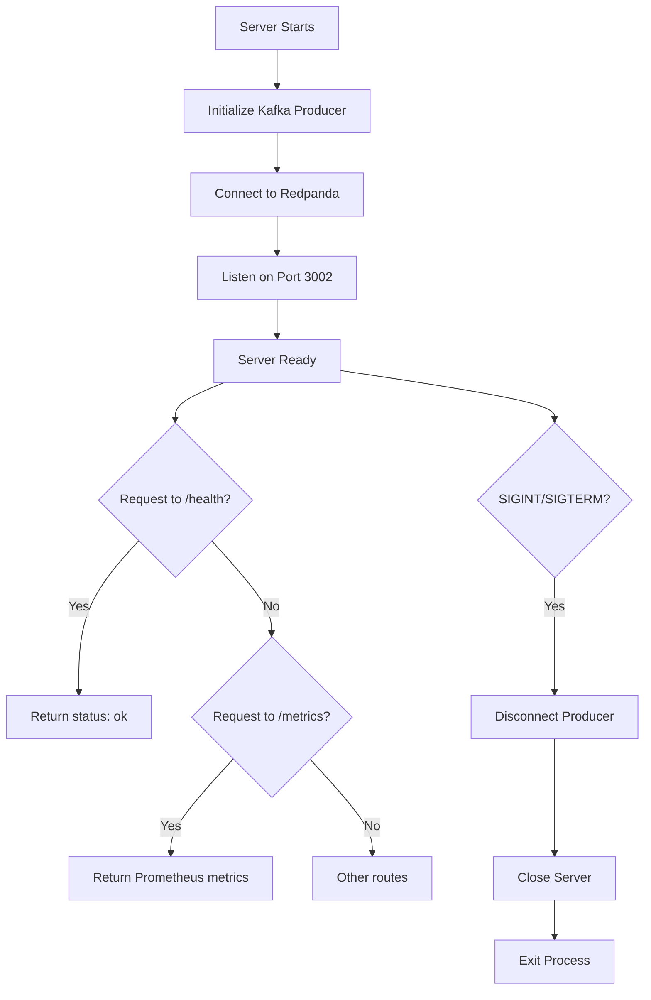
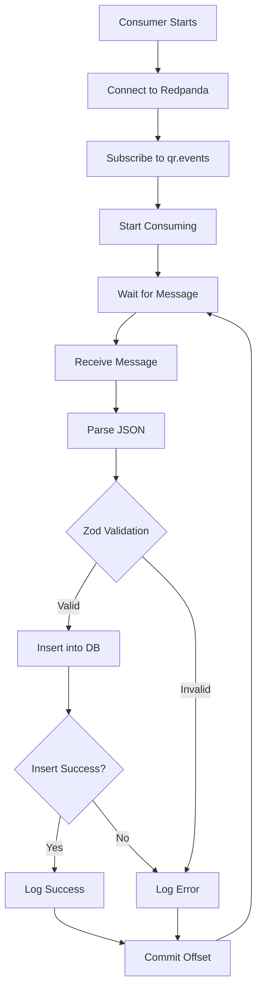
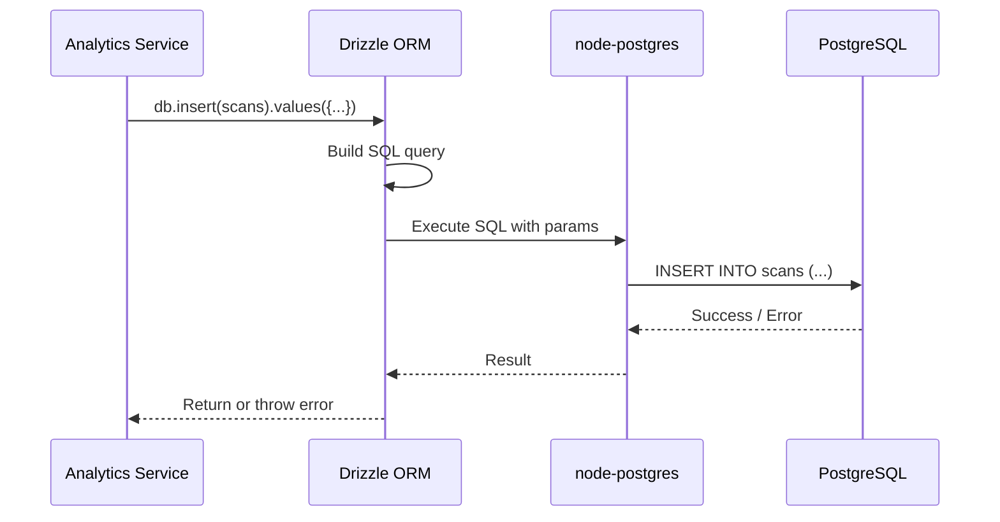
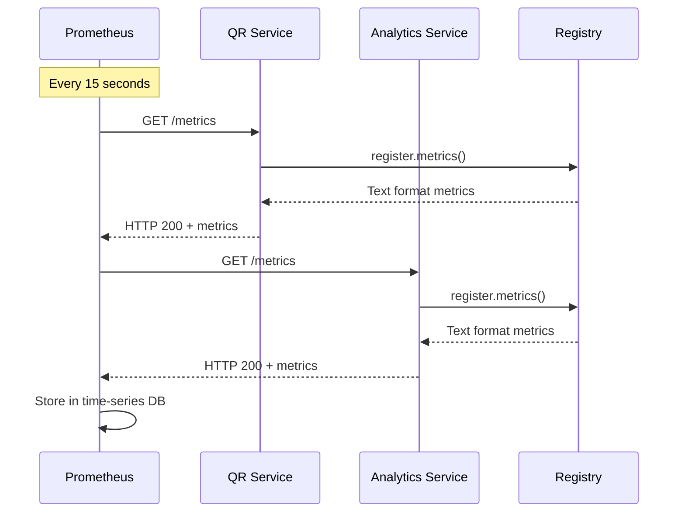

# Code Explanation Guide

This document provides detailed explanations of how the code works in each service.

---

## 📋 Table of Contents

- [QR Service Code Walkthrough](#qr-service-code-walkthrough)
- [Analytics Service Code Walkthrough](#analytics-service-code-walkthrough)
- [Common Package Code](#common-package-code)
- [Key Programming Concepts](#key-programming-concepts)
- [Code Flow Diagrams](#code-flow-diagrams)

---

## 🎯 QR Service Code Walkthrough

**File:** `services/qr-service/src/index.ts`

### What This Service Does
Receives QR scan events and publishes them to a message queue for processing.

### Code Breakdown

#### 1. Import Statements
```typescript
import { buildServer, logger, createProducer, QREventSchema } from "@qr/common";
import { Producer } from "kafkajs";
```

**What this means:**
- `buildServer` - Function that creates a Fastify web server with built-in logging and health checks
- `logger` - Pre-configured logging utility (Pino) for structured logs
- `createProducer` - Helper function to create a Kafka producer
- `QREventSchema` - Zod schema for validating event data
- `Producer` - TypeScript type definition from KafkaJS library

#### 2. Global Variables
```typescript
let producer: Producer | null = null;
```

**What this means:**
- Declares a variable to hold the Kafka producer instance
- `| null` means it can be either a Producer or null (not initialized yet)
- Used globally so multiple functions can access it

#### 3. Initialize Message Queue Function
```typescript
async function initMQ() {
  producer = createProducer();
  await producer.connect();
  logger.info("Kafka producer connected");
  
  // Send a test event
  const payload = {
    event: "qr.scanned" as const,
    qrId: "qr_abc",
    userId: "user_123",
    timestamp: new Date().toISOString(),
  };

  await producer.send({
    topic: "qr.events",
    messages: [{
      key: "qr.scanned",
      value: JSON.stringify(payload),
      headers: { "x-event-type": "qr.scanned" }
    }]
  });
}
```

**Line-by-line explanation:**

```typescript
async function initMQ() {
```
- `async` - Function can perform asynchronous operations (like network calls)
- Allows using `await` inside the function

```typescript
producer = createProducer();
```
- Calls helper function to create a new Kafka producer
- Assigns it to the global `producer` variable

```typescript
await producer.connect();
```
- `await` - Waits for the connection to complete before moving on
- Connects to the Kafka/Redpanda broker

```typescript
const payload = {
  event: "qr.scanned" as const,
  qrId: "qr_abc",
  userId: "user_123",
  timestamp: new Date().toISOString(),
};
```
- Creates a sample event object
- `as const` - Tells TypeScript this is a literal value, not just any string
- `new Date().toISOString()` - Current time in ISO format (e.g., "2025-11-10T16:00:00Z")

```typescript
await producer.send({
  topic: "qr.events",
  messages: [{
    key: "qr.scanned",
    value: JSON.stringify(payload),
    headers: { "x-event-type": "qr.scanned" }
  }]
});
```
- Sends the event to Kafka
- `topic` - Which Kafka topic to send to
- `key` - Used for message ordering/partitioning
- `value` - The actual event data (must be a string, so we use `JSON.stringify`)
- `headers` - Metadata about the message

#### 4. Graceful Shutdown Function
```typescript
async function gracefulShutdown() {
  logger.info("Shutting down gracefully...");
  
  if (producer) {
    await producer.disconnect();
    logger.info("Kafka producer disconnected");
  }
  
  await app.close();
  logger.info("Server closed");
  process.exit(0);
}
```

**What this does:**
- Called when the application is shutting down (Ctrl+C or server restart)
- Ensures all resources are properly cleaned up
- `process.exit(0)` - Exit the program (0 = success)

**Why it's important:**
- Prevents data loss (finishes sending pending messages)
- Closes network connections properly
- Prevents resource leaks

#### 5. Main Execution
```typescript
const app = buildServer("qr-service");

app.listen({ port: 3002, host: "0.0.0.0" }, async (err, address) => {
  if (err) {
    logger.error(err);
    process.exit(1);
  }
  logger.info(`Server listening at ${address}`);
  await initMQ();
});
```

**Breakdown:**

```typescript
const app = buildServer("qr-service");
```
- Creates a Fastify server instance
- Includes pre-configured routes: `/health`, `/metrics`

```typescript
app.listen({ port: 3002, host: "0.0.0.0" }, async (err, address) => {
```
- Starts the server on port 3002
- `host: "0.0.0.0"` - Makes it accessible from any network interface
- Callback function runs when server starts

```typescript
if (err) {
  logger.error(err);
  process.exit(1);
}
```
- Error handling - if server fails to start, log error and exit
- `process.exit(1)` - Exit with error code (non-zero = failure)

```typescript
await initMQ();
```
- After server starts successfully, initialize Kafka producer

---

## 📊 Analytics Service Code Walkthrough

**File:** `services/analytics-service/src/index.ts`

### What This Service Does
Consumes events from Kafka, validates them, and stores them in PostgreSQL database.

### Code Breakdown

#### 1. Import Statements
```typescript
import { buildServer, logger, createConsumer, QREventSchema } from "@qr/common";
import { db } from "./db";
import { scans } from "./schema";
```

**What this imports:**
- `createConsumer` - Helper to create Kafka consumer
- `db` - Database connection instance
- `scans` - Database table schema definition

#### 2. Consumer Initialization
```typescript
const consumer = createConsumer("analytics-group");

await consumer.connect();
await consumer.subscribe({ topics: ["qr.events"], fromBeginning: false });
```

**Explanation:**

```typescript
const consumer = createConsumer("analytics-group");
```
- Creates a Kafka consumer
- `"analytics-group"` - Consumer group name (allows multiple instances to share work)

```typescript
await consumer.subscribe({ topics: ["qr.events"], fromBeginning: false });
```
- Subscribe to the "qr.events" topic
- `fromBeginning: false` - Only read new messages (not old ones)

#### 3. Message Processing
```typescript
await consumer.run({
  eachMessage: async ({ topic, partition, message }) => {
    try {
      const value = QREventSchema.parse(
        JSON.parse(message.value!.toString())
      );
      
      logger.info({ value }, "Received event from Redpanda");
      
      await db.insert(scans).values({
        qrId: value.qrId,
        userId: value.userId,
        timestamp: new Date(value.timestamp),
        eventType: value.event,
        rawPayload: value,
      });
      
      logger.info({ qrId: value.qrId, userId: value.userId }, "Scan event stored in DB");
      
    } catch (error) {
      logger.error({ error, topic, partition }, "Failed to process message");
    }
  },
});
```

**Step-by-step breakdown:**

```typescript
await consumer.run({
  eachMessage: async ({ topic, partition, message }) => {
```
- `consumer.run()` - Starts consuming messages
- `eachMessage` - Callback function called for every message
- Receives: topic name, partition number, and message object

```typescript
const value = QREventSchema.parse(
  JSON.parse(message.value!.toString())
);
```
- `message.value!.toString()` - Convert message bytes to string
  - `!` - TypeScript operator saying "I know this is not null"
- `JSON.parse()` - Convert JSON string to JavaScript object
- `QREventSchema.parse()` - Validate the object matches expected schema
  - Throws error if validation fails

```typescript
await db.insert(scans).values({
  qrId: value.qrId,
  userId: value.userId,
  timestamp: new Date(value.timestamp),
  eventType: value.event,
  rawPayload: value,
});
```
- `db.insert(scans)` - Insert into the "scans" table
- `.values({...})` - The data to insert
- Drizzle ORM converts this to SQL: 
  ```sql
  INSERT INTO scans (qr_id, user_id, timestamp, event_type, raw_payload) 
  VALUES ($1, $2, $3, $4, $5)
  ```

```typescript
} catch (error) {
  logger.error({ error, topic, partition }, "Failed to process message");
}
```
- If anything goes wrong (validation, database), catch the error
- Log it with context (which topic, partition)
- Consumer will continue with next message

---

## 🔧 Common Package Code

### File: `packages/common/src/index.ts` - Server Builder

```typescript
export function buildServer(serviceName: string) {
  const app = fastify({
    logger: {
      level: "info",
      transport: {
        target: "pino-pretty",
        options: { colorize: true }
      }
    }
  });
```

**What this does:**
- Creates a reusable function that any service can call
- Configures Fastify with pretty-printed logs
- `serviceName` - Passed in so logs show which service is logging

```typescript
app.addHook("onRequest", async (request, reply) => {
  request.startTime = Date.now();
});

app.addHook("onResponse", async (request, reply) => {
  const duration = Date.now() - (request.startTime || Date.now());
  logger.info({
    method: request.method,
    url: request.url,
    statusCode: reply.statusCode,
    duration: `${duration}ms`,
  });
});
```

**What hooks do:**
- `onRequest` - Runs before handling any request
  - Records the start time
- `onResponse` - Runs after sending response
  - Calculates how long the request took
  - Logs request details with duration

**Why this is useful:**
- Automatic request logging for all routes
- Performance monitoring (know which requests are slow)
- Debugging (see exactly what requests came in)

```typescript
app.get("/health", async (request, reply) => {
  return { status: "ok", service: serviceName };
});
```
- Health check endpoint
- Returns service name and status
- Used by monitoring systems to check if service is alive

```typescript
app.get("/metrics", async (request, reply) => {
  reply.header("Content-Type", register.contentType);
  return register.metrics();
});
```
- Prometheus metrics endpoint
- Returns metrics in Prometheus text format
- Scraped by Prometheus server every 15 seconds

### File: `packages/common/src/event.ts` - Event Schema

```typescript
import { z } from "zod";

export const QREventSchema = z.object({
  event: z.literal("qr.scanned"),
  qrId: z.string().min(1),
  userId: z.string().min(1),
  timestamp: z.string().datetime(),
});
```

**What Zod schemas do:**

```typescript
z.object({...})
```
- Defines the shape of a valid event object

```typescript
event: z.literal("qr.scanned")
```
- Field must be exactly the string "qr.scanned"
- Rejects anything else (typos, wrong event types)

```typescript
z.string().min(1)
```
- Must be a string with at least 1 character
- Rejects empty strings, numbers, nulls

```typescript
z.string().datetime()
```
- Must be a valid ISO 8601 datetime string
- Example: "2025-11-10T16:00:00Z"

**Why use schemas?**
- **Type Safety** - TypeScript knows the exact shape
- **Runtime Validation** - Catches bad data before it causes errors
- **Self-Documenting** - Schema shows what valid data looks like
- **Error Messages** - Zod provides detailed validation errors

### File: `packages/common/src/metrics.ts` - Prometheus Metrics

```typescript
import * as client from "prom-client";

export const register = new client.Registry();

client.collectDefaultMetrics({ register });
```

**Explanation:**

```typescript
import * as client from "prom-client";
```
- Import as namespace (required for ESM modules)
- Gives access to all Prometheus client functions

```typescript
export const register = new client.Registry();
```
- Creates a registry to store all metrics
- Think of it as a container that holds all measurements

```typescript
client.collectDefaultMetrics({ register });
```
- Automatically collects system metrics:
  - CPU usage
  - Memory usage
  - Garbage collection
  - Node.js event loop lag

```typescript
export const httpRequestDurationMicroseconds = new client.Histogram({
  name: "http_request_duration_ms",
  help: "Duration of HTTP requests in ms",
  labelNames: ["service", "method", "status"],
  buckets: [0.001, 0.005, 0.01, 0.05, 0.1, 0.5, 1, 2, 5, 10],
  registers: [register],
});
```

**Breakdown:**

```typescript
new client.Histogram({...})
```
- Creates a histogram metric
- Histogram groups values into buckets (fast vs slow requests)

```typescript
labelNames: ["service", "method", "status"]
```
- Each metric can have labels for filtering
- Example: `http_request_duration_ms{service="qr-service", method="GET", status="200"}`

```typescript
buckets: [0.001, 0.005, 0.01, 0.05, 0.1, 0.5, 1, 2, 5, 10]
```
- Time ranges in seconds
- Prometheus counts how many requests fall into each bucket
- Allows calculating percentiles (95% of requests under X seconds)

---

## 💡 Key Programming Concepts

### 1. Async/Await

**Without async/await (callback hell):**
```typescript
producer.connect(function(err) {
  if (err) throw err;
  producer.send(message, function(err) {
    if (err) throw err;
    console.log("Message sent");
  });
});
```

**With async/await:**
```typescript
await producer.connect();
await producer.send(message);
console.log("Message sent");
```

**Why it's better:**
- Reads like synchronous code (top to bottom)
- Easier error handling with try/catch
- No nested callbacks

### 2. TypeScript Types

**JavaScript (no types):**
```javascript
function processEvent(event) {
  return event.qrId;  // Might crash if qrId doesn't exist
}
```

**TypeScript (with types):**
```typescript
interface QREvent {
  qrId: string;
  userId: string;
}

function processEvent(event: QREvent): string {
  return event.qrId;  // TypeScript guarantees qrId exists
}
```

**Benefits:**
- Catches errors before running code
- IDE autocomplete (knows what fields exist)
- Self-documenting (function signature shows expected data)

### 3. Dependency Injection Pattern

**Bad (hard-coded dependencies):**
```typescript
// Hard to test, hard to change
const logger = new PinoLogger();
const db = new PostgresDB("localhost:5432");
```

**Good (inject dependencies):**
```typescript
// Easy to test (inject mock logger/db)
function createService(logger: Logger, db: Database) {
  return { logger, db };
}
```

**Why it's used:**
- Easy to swap implementations (test vs production database)
- Services don't need to know how dependencies are created
- Better for unit testing

### 4. Event-Driven Architecture

**Traditional (synchronous):**
```typescript
// QR Service directly calls Analytics Service
await analyticsService.processEvent(event);
// If analytics is down, request fails
```

**Event-Driven (asynchronous):**
```typescript
// QR Service publishes event and moves on
await producer.send(event);
// Analytics processes when ready
```

**Benefits:**
- Loose coupling - services don't know about each other
- Resilience - if one service is down, events queue up
- Scalability - add more consumers to process faster

---

## 📊 Code Flow Diagrams

### QR Service Request Flow



### Analytics Service Message Processing



### Database Insert Flow



### Metrics Collection Flow



---

## 🎓 Advanced Concepts

### 1. Consumer Groups

**Problem:** What if one consumer can't keep up with millions of messages?

**Solution:** Consumer groups allow multiple consumers to share the work

```
Topic: qr.events (3 partitions)
Consumer Group: analytics-group

Partition 0 → Consumer Instance 1
Partition 1 → Consumer Instance 2  
Partition 2 → Consumer Instance 3
```

**Benefits:**
- Parallel processing (3x faster with 3 consumers)
- Fault tolerance (if one crashes, others rebalance)
- Scalability (add more consumers as needed)

### 2. Message Ordering

**Kafka Guarantees:**
- Messages in same partition are ordered
- Messages with same key go to same partition

**Example:**
```typescript
// All events for user_123 go to same partition
await producer.send({
  topic: "qr.events",
  messages: [{
    key: "user_123",  // Determines partition
    value: JSON.stringify(event)
  }]
});
```

**Why it matters:**
- Process user events in order
- Prevent race conditions

### 3. Error Handling Strategies

**1. Retry with Backoff**
```typescript
let retries = 0;
while (retries < 3) {
  try {
    await db.insert(scans).values(data);
    break;
  } catch (error) {
    retries++;
    await sleep(retries * 1000);  // Wait 1s, 2s, 3s
  }
}
```

**2. Dead Letter Queue (DLQ)**
```typescript
try {
  await processMessage(message);
} catch (error) {
  // Send to DLQ for manual review
  await producer.send({
    topic: "analytics.errors",
    messages: [{ value: JSON.stringify(message) }]
  });
}
```

**3. Circuit Breaker**
```typescript
// If DB fails 5 times, stop trying for 60 seconds
if (failureCount > 5) {
  await sleep(60000);
  failureCount = 0;
}
```

### 4. Database Transactions

**Problem:** What if we need to insert into multiple tables?

```typescript
await db.transaction(async (tx) => {
  // Both succeed or both fail
  await tx.insert(scans).values(scanData);
  await tx.insert(analytics).values(analyticsData);
});
```

**ACID Properties:**
- **A**tomic - All or nothing
- **C**onsistent - Data always valid
- **I**solated - Concurrent transactions don't interfere
- **D**urable - Committed data survives crashes

---

## 📝 Code Best Practices Used

### 1. Structured Logging
```typescript
// Bad
console.log("Error:", error);

// Good
logger.error({ error, userId, qrId }, "Failed to process scan");
```

**Benefits:**
- Machine-readable (can be queried)
- Includes context (who, what, when, where)
- Consistent format across services

### 2. Environment Variables
```typescript
// Bad
const dbUrl = "postgresql://localhost:5432/postgres";

// Good
const dbUrl = process.env.DATABASE_URL || "postgresql://localhost:5432/postgres";
```

**Benefits:**
- Different config for dev/staging/production
- Secrets not in code (security)
- Easy to change without code changes

### 3. Graceful Shutdown
```typescript
process.on("SIGTERM", gracefulShutdown);
process.on("SIGINT", gracefulShutdown);
```

**Why:**
- Finish processing current requests
- Close database connections
- Prevent data loss
- Clean exit (no zombie processes)

### 4. Type Safety
```typescript
// Zod validates at runtime
const event = QREventSchema.parse(data);

// TypeScript validates at compile time
type QREvent = z.infer<typeof QREventSchema>;
```

**Benefits:**
- Catch errors early (before production)
- Self-documenting code
- Better IDE support

---

## 🔍 Debugging Tips

### 1. Reading Logs

**Structured log example:**
```json
{
  "level": "error",
  "time": 1699632000000,
  "msg": "Failed to process message",
  "error": {
    "name": "ZodError",
    "issues": [
      {
        "code": "invalid_type",
        "expected": "string",
        "received": "undefined",
        "path": ["qrId"]
      }
    ]
  },
  "topic": "qr.events",
  "partition": 0
}
```

**What to look for:**
- `level: error` - It's an error
- `path: ["qrId"]` - The `qrId` field is the problem
- `expected: string, received: undefined` - Field is missing

### 2. Testing Kafka Messages

```bash
# View messages in topic
docker exec -it qr_redpanda rpk topic consume qr.events

# Check consumer lag (how behind is consumer?)
docker exec -it qr_redpanda rpk group describe analytics-group
```

### 3. Database Queries

```sql
-- See recent scans
SELECT * FROM scans ORDER BY timestamp DESC LIMIT 10;

-- Check for validation errors in raw_payload
SELECT raw_payload FROM scans WHERE event_type IS NULL;

-- Count scans per user
SELECT user_id, COUNT(*) FROM scans GROUP BY user_id;
```

---

**Last Updated:** November 10, 2025
