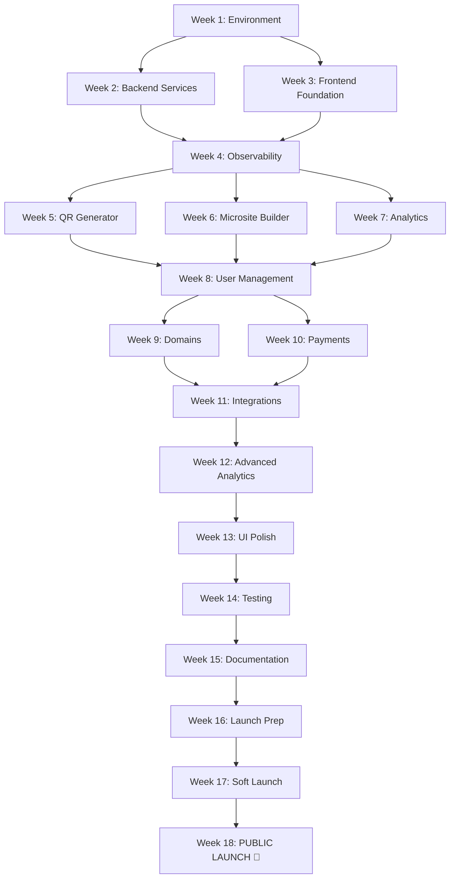

# 📅 QR Code Platform - Project Timeline (Gantt Chart)

**Project Duration:** August 1, 2025 - December 5, 2025 (18 weeks)  
**Launch Date:** December 1, 2025

---

## Visual Timeline

```
PHASE 1: FOUNDATION (Weeks 1-4)
════════════════════════════════════════════════════════════════════════════════
Week 1  [░░░░░░░░] Environment Setup (40h)               🔜 NOT STARTED
Week 2  [░░░░░░░░] Core Services (60h)                   🔜 NOT STARTED  
Week 3  [░░░░░░░░] Frontend Foundation (50h)             🔜 NOT STARTED
Week 4  [░░░░░░░░] Observability & DevOps (40h)          🔜 NOT STARTED
        └─────────────────────────────────────┘
              MILESTONE: Infrastructure Complete

PHASE 2: CORE FEATURES & MVP (Weeks 5-8)
════════════════════════════════════════════════════════════════════════════════
Week 5  [░░░░░░░░] QR Code Generator (50h)               🔜 Upcoming
Week 6  [░░░░░░░░] Microsite Builder (60h)               🔜 Upcoming
Week 7  [░░░░░░░░] Analytics Dashboard (50h)             🔜 Upcoming
Week 8  [░░░░░░░░] User Management (40h)                 🔜 Upcoming
        └─────────────────────────────────────┘
              MILESTONE: MVP Ready

PHASE 3: ADVANCED FEATURES (Weeks 9-12)
════════════════════════════════════════════════════════════════════════════════
Week 9  [░░░░░░░░] Domain Management (50h)               🔜 Later
Week 10 [░░░░░░░░] Payments & Subscriptions (50h)        🔜 Later
Week 11 [░░░░░░░░] Integrations (50h)                    🔜 Later
Week 12 [░░░░░░░░] Advanced Analytics & AI (60h)         🔜 Later
        └─────────────────────────────────────┘
              MILESTONE: Feature Complete

PHASE 4: POLISH & LAUNCH (Weeks 13-17)
════════════════════════════════════════════════════════════════════════════════
Week 13 [░░░░░░░░] UI/UX Polish (50h)                    🔜 Later
Week 14 [░░░░░░░░] Testing & Bug Fixes (60h)             🔜 Later
Week 15 [░░░░░░░░] Documentation & SEO (40h)             🔜 Later
Week 16 [░░░░░░░░] Launch Preparation (50h)              🔜 Later
Week 17 [░░░░░░░░] Soft Launch (40h)                     🔜 Later
Week 18 [░░░░░░░░] Public Launch (20h)                   🚀 LAUNCH!
        └─────────────────────────────────────┘
              MILESTONE: Public Launch 🎉
```

---

## Detailed Weekly Breakdown

### 📌 PHASE 1: Foundation & Infrastructure

| Week | Dates | Tasks | Hours | Team | Status | Deliverables |
|------|-------|-------|-------|------|--------|--------------|
| **1** | Aug 1-7 | Environment Setup | 40h | 2 devs | 🔜 NOT STARTED | Docker running, all services up |
| **2** | Aug 8-14 | Core Backend Services | 60h | 2-3 devs | 🔜 NOT STARTED | Auth, QR, Microsite, Domain, Analytics services |
| **3** | Aug 15-21 | Frontend Foundation | 50h | 2 devs | 🔜 NOT STARTED | React app, design system, basic pages |
| **4** | Aug 22-28 | Observability & DevOps | 40h | 2 devs | 🔜 NOT STARTED | Mixpanel + Sentry setup, CI/CD pipeline |

**Phase 1 Total:** 190 hours over 4 weeks  
**End Date:** August 28, 2025  
**Milestone:** Infrastructure complete, all services communicating

---

### 📌 PHASE 2: Core Features & MVP

| Week | Dates | Tasks | Hours | Team | Status | Deliverables |
|------|-------|-------|-------|------|--------|--------------|
| **5** | Sep 1-5 | QR Code Generator | 50h | 2-3 devs | 🔜 Upcoming | 8 QR types, customization, export |
| **6** | Sep 8-12 | Microsite Builder | 60h | 2-3 devs | 🔜 Upcoming | 40 blocks working, drag-and-drop |
| **7** | Sep 15-19 | Analytics Dashboard | 50h | 2 devs | 🔜 Upcoming | Charts, real-time data, exports |
| **8** | Sep 22-26 | User Management | 40h | 2 devs | 🔜 Upcoming | Profile, QR library, onboarding |

**Phase 2 Total:** 200 hours over 4 weeks  
**End Date:** September 26, 2025  
**Milestone:** MVP complete, ready for alpha testing

---

### 📌 PHASE 3: Advanced Features

| Week | Dates | Tasks | Hours | Team | Status | Deliverables |
|------|-------|-------|-------|------|--------|--------------|
| **9** | Sep 29 - Oct 3 | Domain Management | 50h | 2-3 devs | 🔜 Later | Subdomains + custom domains working |
| **10** | Oct 6-10 | Payments & Subscriptions | 50h | 2 devs | 🔜 Later | Stripe integration, 4 plans live |
| **11** | Oct 13-17 | Integrations | 50h | 2-3 devs | 🔜 Later | 8+ integrations (GA, Mailchimp, Shopify) |
| **12** | Oct 20-24 | Advanced Analytics & AI | 60h | 2-3 devs | 🔜 Later | Funnels, cohorts, AI recommendations |

**Phase 3 Total:** 210 hours over 4 weeks  
**End Date:** October 24, 2025  
**Milestone:** All major features complete, platform feature-rich

---

### 📌 PHASE 4: Polish & Launch

| Week | Dates | Tasks | Hours | Team | Status | Deliverables |
|------|-------|-------|-------|------|--------|--------------|
| **13** | Oct 27-31 | UI/UX Polish | 50h | 2-3 devs | 🔜 Later | Beautiful UI, smooth animations, accessibility |
| **14** | Nov 3-7 | Testing & Bug Fixes | 60h | 2-3 devs | 🔜 Later | >70% test coverage, all bugs fixed |
| **15** | Nov 10-14 | Documentation & SEO | 40h | 2 devs | 🔜 Later | Help center, API docs, SEO optimization |
| **16** | Nov 17-21 | Launch Preparation | 50h | 2-3 devs | 🔜 Later | Production deployed, security hardened |
| **17** | Nov 24-28 | Soft Launch | 40h | Full team | 🔜 Later | Beta users, feedback, quick fixes |
| **18** | Dec 1-5 | Public Launch | 20h | Full team | 🚀 LAUNCH! | Product Hunt, social media, first 500 users |

**Phase 4 Total:** 260 hours over 6 weeks  
**End Date:** December 5, 2025  
**Milestone:** 🎉 PUBLIC LAUNCH! Platform live and scaling

---

## Critical Path

```
START → Week 1-4 (Infrastructure) → Week 5-8 (MVP) → Week 9-12 (Features) → Week 13-18 (Launch) → END
   │                                      │                 │                        │
   └─ Must Complete First                 │                 │                        │
                                          │                 │                        │
                                    MVP Checkpoint      Feature Lock           Launch Day
                                    (Sep 26, 2025)    (Oct 24, 2025)        (Dec 1, 2025)
```

---

## Dependencies Map



---

## Resource Allocation

### By Week (Hours per Developer)

```
Week  | Dev 1 (Backend) | Dev 2 (Frontend) | Dev 3 (Full-stack) | Total
------|-----------------|------------------|--------------------|-------
  1   |      25h        |      15h         |       -            |  40h
  2   |      35h        |      15h         |      10h           |  60h
  3   |      15h        |      30h         |       5h           |  50h
  4   |      20h        |      15h         |       5h           |  40h
  5   |      25h        |      20h         |       5h           |  50h
  6   |      20h        |      30h         |      10h           |  60h
  7   |      15h        |      30h         |       5h           |  50h
  8   |      15h        |      20h         |       5h           |  40h
  9   |      30h        |      15h         |       5h           |  50h
 10   |      35h        |      10h         |       5h           |  50h
 11   |      25h        |      20h         |       5h           |  50h
 12   |      30h        |      20h         |      10h           |  60h
 13   |      10h        |      30h         |      10h           |  50h
 14   |      30h        |      20h         |      10h           |  60h
 15   |      15h        |      20h         |       5h           |  40h
 16   |      30h        |      15h         |       5h           |  50h
 17   |      15h        |      20h         |       5h           |  40h
 18   |      10h        |       5h         |       5h           |  20h
------|-----------------|------------------|--------------------|-------
Total |     400h        |     350h         |     100h           | 850h
```

---

## Milestones & Checkpoints

### Milestone 1: Infrastructure Complete (Aug 28, 2025)
- [ ] All services running in Docker
- [ ] Database migrations working
- [ ] Basic API endpoints functional
- [ ] Observability fully integrated
- [ ] CI/CD pipeline operational

**Status:** Not started

---

### Milestone 2: MVP Ready (Sep 26, 2025)
- [ ] Users can sign up and log in
- [ ] Users can create QR codes (8 types)
- [ ] Users can build microsites (40 blocks)
- [ ] Users can view analytics
- [ ] Mobile-responsive UI
- [ ] Basic onboarding flow

**Target:** Complete MVP for alpha testing

---

### Milestone 3: Feature Complete (Oct 24, 2025)
- [ ] Custom domains working
- [ ] Payment processing live
- [ ] 8+ integrations functional
- [ ] Advanced analytics operational
- [ ] AI features active
- [ ] All features tested

**Target:** Feature freeze, begin polish phase

---

### Milestone 4: Launch Ready (Nov 21, 2025)
- [ ] Production environment stable
- [ ] All tests passing (>70% coverage)
- [ ] Documentation complete
- [ ] Security audit passed
- [ ] Performance optimized
- [ ] Marketing materials ready

**Target:** Platform ready for soft launch

---

### Milestone 5: Soft Launch (Nov 28, 2025)
- [ ] 100 beta users onboarded
- [ ] Critical feedback incorporated
- [ ] All major bugs fixed
- [ ] Launch materials finalized
- [ ] Monitoring operational

**Target:** Prepare for public launch

---

### Milestone 6: Public Launch 🚀 (Dec 1, 2025)
- [ ] Product Hunt featured
- [ ] Social media launched
- [ ] First 500 signups
- [ ] 99.9% uptime
- [ ] Positive user feedback

**Target:** Successful public launch!

---

## Risk Timeline

| Week | Risk | Probability | Mitigation | Buffer |
|------|------|-------------|------------|--------|
| 2 | Kafka integration issues | Medium | Pre-test with sample data | +1 day |
| 4 | CI/CD pipeline complexity | Medium | Use GitHub Actions templates | +1 day |
| 6 | Drag-and-drop bugs | High | Use battle-tested library (dnd-kit) | +2 days |
| 9 | DNS propagation delays | Medium | Use Cloudflare API, not manual | +1 day |
| 10 | Stripe webhook failures | Low | Implement retry logic | +1 day |
| 14 | Test coverage gaps | Medium | Prioritize critical paths | +2 days |
| 16 | Production deployment issues | High | Stage deployment, test thoroughly | +3 days |

**Total Buffer Time:** 11 days (included in 18-week timeline)

---

## Weekly Standup Schedule

### Monday (Week Planning)
- Review last week's progress
- Assign tasks for current week
- Identify blockers
- Update Gantt chart

### Wednesday (Mid-week Check)
- Progress update
- Address blockers
- Adjust priorities if needed

### Friday (Week Wrap-up)
- Demo completed features
- Update task completion %
- Plan for next week

---

## Success Metrics by Phase

### Phase 1 (Foundation)
- ✅ All services pass health checks
- ✅ <100ms API response time
- ✅ Database queries optimized
- [ ] 100% service uptime locally

### Phase 2 (MVP)
- [ ] Alpha users can complete signup → QR → publish flow
- [ ] <5s page load time
- [ ] 90% feature completion
- [ ] Positive alpha feedback

### Phase 3 (Features)
- [ ] Payment processing 99.9% success rate
- [ ] Domain setup <2 min
- [ ] 8+ integrations tested
- [ ] Advanced analytics accurate

### Phase 4 (Launch)
- [ ] 99.9% uptime in production
- [ ] <2s page load time
- [ ] 500+ signups week 1
- [ ] 4.5+ star rating
- [ ] <10 critical bugs

---

## Launch Day Checklist (Dec 1, 2025)

### Morning (9 AM - 12 PM PST)
- [ ] 9:00 AM - Final production check
- [ ] 9:30 AM - Publish Product Hunt
- [ ] 10:00 AM - Tweet announcement
- [ ] 10:30 AM - LinkedIn post
- [ ] 11:00 AM - Email waitlist
- [ ] 11:30 AM - Monitor signups

### Afternoon (12 PM - 6 PM PST)
- [ ] 12:00 PM - Post on Hacker News
- [ ] 1:00 PM - Reddit posts (r/SideProject, r/startups)
- [ ] 2:00 PM - IndieHackers post
- [ ] 3:00 PM - Respond to comments
- [ ] 4:00 PM - Monitor server health
- [ ] 5:00 PM - Check analytics
- [ ] 6:00 PM - End of day recap

### Evening (6 PM - 11 PM PST)
- [ ] Monitor support requests
- [ ] Fix urgent bugs
- [ ] Engage with users
- [ ] Celebrate launch! 🎉

---

## Post-Launch Timeline (December 2025 - May 2026)

```
Month 2 (Jan 2026)    [░░░░] Team features, API access
Month 3 (Feb 2026)    [░░░░] Mobile apps, bulk QR
Month 4 (Mar 2026)    [░░░░] Zapier, more integrations
Month 5 (Apr 2026)    [░░░░] Reseller program, advanced reports
Month 6 (May 2026)    [░░░░] Enterprise features, SLA
```

---

## Key Dates Summary

| Event | Date | Days from Now |
|-------|------|---------------|
| **Current Date** | Jan 30, 2026 | - |
| Project Start | Aug 1, 2025 | ⚠️ PAST (6 months ago) |
| Phase 1 Complete | Aug 28, 2025 | ⚠️ PAST |
| MVP Complete | Sep 26, 2025 | ⚠️ PAST |
| Feature Complete | Oct 24, 2025 | ⚠️ PAST |
| Soft Launch | Nov 28, 2025 | ⚠️ PAST |
| 🚀 Public Launch | Dec 1, 2025 | ⚠️ PAST (2 months ago) |

> **⚠️ TIMELINE NEEDS ADJUSTMENT**  
> Original timeline was Aug 2025 - Dec 2025.  
> Current date is Jan 30, 2026.  
> **Recommendation:** Start fresh from Feb 1, 2026 with 4-month timeline → Launch June 2026

---

**Chart Legend:**
- 🔜 Not Started
- ⏳ In Progress
- ✅ Complete
- 🚀 Launch Event
- ⚠️ Timeline needs adjustment (use for reference only)

---

**Last Updated:** January 30, 2026  
**Next Review:** Weekly standup  
**Timeline:** August 2025 - December 2025 (REFERENCE ONLY - needs new dates)
