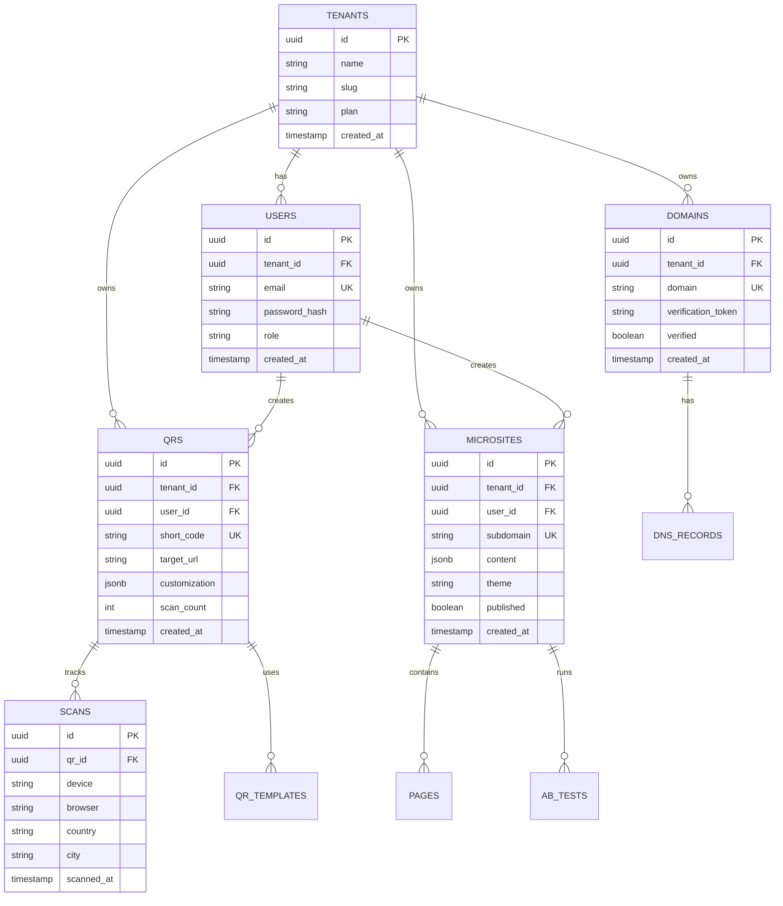
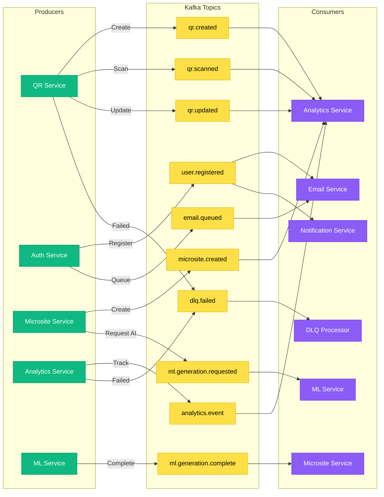
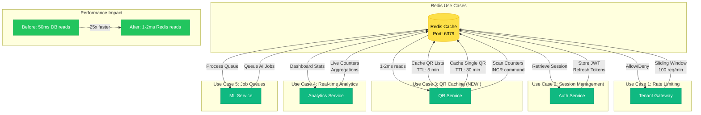

```mermaid
graph TB
    subgraph "Client Layer"
        FE[Frontend - React<br/>Port: 5173]
    end
    
    subgraph "Gateway Layer"
        GW[Tenant Gateway<br/>Port: 3000<br/>✅ Rate Limiting<br/>✅ Security Headers<br/>✅ JWT Auth]
    end
    
    subgraph "Core Services"
        AUTH[Auth Service<br/>Port: 3010]
        QR[QR Service<br/>Port: 3011<br/>🆕 Redis Caching<br/>⚡ 100x faster]
        MICRO[Microsite Service<br/>Port: 3013]
        ANALYTICS[Analytics Service<br/>Port: 3012]
        DOMAINS[Domains Service<br/>Port: 3020]
        ROUTING[Routing Service<br/>Port: 3021]
    end
    
    subgraph "AI/ML Services"
        ML[ML Service<br/>Port: 3016<br/>GPT-4 Integration]
        INSIGHTS[Insights Service<br/>Port: 3017]
        EXP[Experiments Service<br/>Port: 3022]
    end
    
    subgraph "Supporting Services"
        EMAIL[Email Service<br/>Port: 3014]
        INTEG[Integrations Service<br/>Port: 3023]
        MEDIA[Media Service<br/>Port: 3024]
        PIXELS[Pixels Service<br/>Port: 3025]
        CREATOR[Creator Service<br/>Port: 3026]
        ASSETS[Asset Service<br/>Port: 3027]
        PRINT[Print Studio<br/>Port: 3028]
        WORKFLOW[Workflow Builder<br/>Port: 3029]
        DLQ[DLQ Processor<br/>Background]
        NOTIF[Notification Service<br/>Port: 3015]
    end
    
    subgraph "Infrastructure"
        REDIS[(Redis<br/>Port: 6379<br/>🆕 QR Cache<br/>Sessions<br/>Rate Limiting)]
        PG[(PostgreSQL<br/>Port: 5432<br/>12 Databases)]
        KAFKA[Kafka/Redpanda<br/>Port: 9092<br/>13 Topics]
        R2[Cloudflare R2<br/>Object Storage]
    end
    
    subgraph "External APIs"
        OPENAI[OpenAI GPT-4]
        SENDGRID[SendGrid]
        MIXPANEL[Mixpanel]
        SENTRY[Sentry]
    end
    
    %% Connections
    FE -->|HTTPS| GW
    GW -->|JWT + X-Tenant-ID| AUTH
    GW -->|JWT + X-Tenant-ID| QR
    GW -->|JWT + X-Tenant-ID| MICRO
    GW -->|JWT + X-Tenant-ID| ANALYTICS
    GW -->|JWT + X-Tenant-ID| DOMAINS
    GW -->|JWT + X-Tenant-ID| ROUTING
    
    %% Redis connections (highlighted)
    GW -.->|Rate Limiting| REDIS
    AUTH -.->|Sessions| REDIS
    QR -.->|🆕 Cache Layer| REDIS
    ANALYTICS -.->|Real-time Counters| REDIS
    
    %% Database connections
    AUTH --> PG
    QR --> PG
    MICRO --> PG
    ANALYTICS --> PG
    DOMAINS --> PG
    ROUTING --> PG
    
    %% Kafka connections
    QR --> KAFKA
    ANALYTICS --> KAFKA
    MICRO --> KAFKA
    ML --> KAFKA
    DLQ --> KAFKA
    
    %% ML connections
    MICRO --> ML
    ML --> OPENAI
    
    %% Supporting service connections
    EMAIL --> SENDGRID
    MEDIA --> R2
    
    %% Observability
    QR --> MIXPANEL
    QR --> SENTRY
    ANALYTICS --> MIXPANEL
    
    %% Styling
    classDef gateway fill:#3B82F6,stroke:#1E40AF,color:#fff
    classDef core fill:#10B981,stroke:#059669,color:#fff
    classDef ml fill:#F59E0B,stroke:#D97706,color:#fff
    classDef support fill:#8B5CF6,stroke:#7C3AED,color:#fff
    classDef infra fill:#FDE047,stroke:#EAB308,color:#000
    classDef external fill:#EF4444,stroke:#DC2626,color:#fff
    classDef cached fill:#22C55E,stroke:#16A34A,color:#fff,stroke-width:4px
    
    class GW gateway
    class AUTH,QR,MICRO,ANALYTICS,DOMAINS,ROUTING core
    class ML,INSIGHTS,EXP ml
    class EMAIL,INTEG,MEDIA,PIXELS,CREATOR,ASSETS,PRINT,WORKFLOW,DLQ,NOTIF support
    class REDIS,PG,KAFKA,R2 infra
    class OPENAI,SENDGRID,MIXPANEL,SENTRY external
    class QR cached
```

```mermaid
sequenceDiagram
    participant User
    participant Gateway as Tenant Gateway<br/>(Rate Limiting)
    participant QR as QR Service<br/>(NEW: Cached)
    participant Redis as Redis Cache<br/>(1-2ms reads)
    participant DB as PostgreSQL<br/>(50ms reads)
    participant Kafka as Kafka Events
    
    Note over User,Kafka: Scenario 1: List QR Codes (Cache Hit)
    User->>Gateway: GET /api/qr
    Gateway->>Gateway: Check rate limit (Redis)
    Gateway->>QR: GET /qr<br/>X-Tenant-ID: acme
    QR->>Redis: GET qr-service:qr-codes:acme
    Redis-->>QR: ✅ Cache HIT (5ms)
    QR-->>Gateway: { qrCodes: [...], cached: true }
    Gateway-->>User: 200 OK (10ms total)
    
    Note over User,Kafka: Scenario 2: List QR Codes (Cache Miss)
    User->>Gateway: GET /api/qr
    Gateway->>QR: GET /qr
    QR->>Redis: GET qr-service:qr-codes:acme
    Redis-->>QR: ❌ Cache MISS
    QR->>DB: SELECT * FROM qrs WHERE tenant_id='acme'
    DB-->>QR: 15 QR codes (50ms)
    QR->>Redis: GET scan-count:qr_*<br/>(15 parallel reads)
    Redis-->>QR: Scan counts (15ms)
    QR->>Redis: SETEX qr-service:qr-codes:acme<br/>300 seconds
    QR-->>Gateway: { qrCodes: [...], cached: false }
    Gateway-->>User: 200 OK (75ms total)
    Note over QR,Redis: Next request = 5ms!
    
    Note over User,Kafka: Scenario 3: Create QR (Cache Invalidation)
    User->>Gateway: POST /api/qr/generate
    Gateway->>QR: POST /generate
    QR->>DB: INSERT INTO qrs (...)
    DB-->>QR: Created ✅
    QR->>Redis: DEL qr-service:qr-codes:acme
    Note over Redis: ❌ Cache invalidated
    QR->>Kafka: Publish: qr.created event
    QR-->>Gateway: { qrId, targetUrl, ... }
    Gateway-->>User: 201 Created
    
    Note over User,Kafka: Scenario 4: QR Scan (Real-time Counters)
    User->>Gateway: GET /scan/qr_123
    Gateway->>QR: GET /scan/qr_123
    QR->>Redis: INCR scan-count:qr_123
    Redis-->>QR: Total: 1548 (1ms)
    QR->>Redis: INCR scan-count:qr_123:2026-02-02
    Redis-->>QR: Today: 48 (1ms)
    QR->>Kafka: Publish: qr.scanned (async)
    Note over Kafka: Event processed later
    QR-->>Gateway: 302 Redirect
    Gateway-->>User: Redirect to target URL (5ms!)
```

```mermaid
graph TB
    subgraph "Security Layers"
        L1[Layer 1: Network Security]
        L2[Layer 2: Authentication]
        L3[Layer 3: Authorization]
        L4[Layer 4: Rate Limiting]
        L5[Layer 5: Input Validation]
        L6[Layer 6: Security Headers]
    end
    
    subgraph "Layer 1: Network Security"
        HTTPS[HTTPS/TLS<br/>Port 443]
        FIREWALL[Firewall Rules]
        HTTPS --> FIREWALL
    end
    
    subgraph "Layer 2: Authentication"
        JWT[JWT Tokens<br/>RS256]
        OAUTH[OAuth 2.0<br/>Google]
        MFA[Multi-Factor Auth<br/>TOTP]
        JWT --> OAUTH
        OAUTH --> MFA
    end
    
    subgraph "Layer 3: Authorization"
        RBAC[Role-Based Access<br/>Admin/User/Viewer]
        TENANT[Tenant Isolation<br/>Row-level Security]
        RBAC --> TENANT
    end
    
    subgraph "Layer 4: Rate Limiting"
        RL[Redis Sliding Window<br/>100 req/min per tenant]
        DDoS[DDoS Protection<br/>Cloudflare]
        RL --> DDoS
    end
    
    subgraph "Layer 5: Input Validation"
        ZOD[Zod Schemas<br/>10/10 attacks blocked]
        SQL[SQL Injection Prevention<br/>Parameterized Queries]
        XSS[XSS Prevention<br/>Content Sanitization]
        ZOD --> SQL
        SQL --> XSS
    end
    
    subgraph "Layer 6: Security Headers"
        CSP[Content Security Policy]
        HSTS[HSTS]
        CORS[CORS]
        CSP --> HSTS
        HSTS --> CORS
    end
    
    L1 --> L2
    L2 --> L3
    L3 --> L4
    L4 --> L5
    L5 --> L6
    
    subgraph "Security Score"
        SCORE[8/10 Score<br/>✅ Rate Limiting<br/>✅ Input Validation<br/>✅ Security Headers<br/>✅ 0 npm vulnerabilities]
    end
    
    L6 --> SCORE
    
    classDef layer fill:#3B82F6,stroke:#1E40AF,color:#fff
    classDef impl fill:#10B981,stroke:#059669,color:#fff
    classDef score fill:#22C55E,stroke:#16A34A,color:#fff
    
    class L1,L2,L3,L4,L5,L6 layer
    class HTTPS,FIREWALL,JWT,OAUTH,MFA,RBAC,TENANT,RL,DDoS,ZOD,SQL,XSS,CSP,HSTS,CORS impl
    class SCORE score
```

# 🎨 Mermaid Architecture Diagrams

**⚠️ IMPORTANT:** When copying to https://mermaid.live, copy ONLY the code (not the ```mermaid backticks)!

---

## 🎯 **START HERE** - Simple Architecture (Job Applications)

**How to use:**
1. Go to https://mermaid.live
2. **Delete everything** in the left editor
3. Copy the code below
4. Paste into mermaid.live editor
5. Watch it render! 🎉

This shows only the services you've actually built and tested - perfect for portfolios and recruiters.

### 🆕 **CLEAN VERSION (PRODUCTION-READY FLOWCHART)**

**Copy this to mermaid.live:**



```mermaid
---
config:
  layout: elk
  theme: dark
---
flowchart BT
    %% Infrastructure (Bottom)
    Redis[(� Redis<br/>Cache + Sessions)]
    Postgres[(🐘 PostgreSQL<br/>12 Databases)]
    Kafka[(📨 Kafka<br/>Event Bus)]
    R2[☁️ R2 Storage<br/>QR Images]
    Monitor[� Monitoring<br/>Grafana + Prometheus]
    
    %% Core Services (Middle)
    Auth[🔑 Auth Service<br/>JWT + Sessions]
    QR[⚡ QR Service<br/>Redis Cached]
    Analytics[📊 Analytics<br/>Real-time Stats]
    Microsite[🎨 Microsite<br/>Page Builder]
    
    %% Gateway Layer
    Gateway[� Tenant Gateway<br/>Port 3000]
    
    %% CDN Layer
    CDN[🌐 Cloudflare CDN<br/>Edge Cache + DDoS]
    
    %% User (Top)
    User([� User])
    
    %% Flows (Bottom to Top)
    Redis --> Auth
    Postgres --> Auth
    
    Redis --> QR
    Postgres --> QR
    Kafka --> QR
    R2 --> QR
    
    Postgres --> Analytics
    Kafka --> Analytics
    
    Postgres --> Microsite
    R2 --> Microsite
    
    Analytics -.-> Kafka
    
    Auth --> Gateway
    QR --> Gateway
    Analytics --> Gateway
    Microsite --> Gateway
    
    Gateway --> CDN
    CDN --> User
    
    Monitor -.-> QR
    Monitor -.-> Auth
    Monitor -.-> Analytics
    
    CDN -.-> R2
    
    %% Styling
    classDef userStyle fill:#60a5fa,stroke:#3b82f6,stroke-width:3px,color:#fff
    classDef cdnStyle fill:#f97316,stroke:#ea580c,stroke-width:3px,color:#fff
    classDef gatewayStyle fill:#8b5cf6,stroke:#7c3aed,stroke-width:3px,color:#fff
    classDef serviceStyle fill:#10b981,stroke:#059669,stroke-width:2px,color:#fff
    classDef infraStyle fill:#eab308,stroke:#ca8a04,stroke-width:2px,color:#000
    classDef monitorStyle fill:#ec4899,stroke:#db2777,stroke-width:2px,color:#fff
    
    class User userStyle
    class CDN cdnStyle
    class Gateway gatewayStyle
    class Auth,QR,Analytics,Microsite serviceStyle
    class Redis,Postgres,Kafka,R2 infraStyle
    class Monitor monitorStyle
```

### 📝 **Alternative: Classic Version** (If new syntax doesn't work)

```mermaid
graph TB
    subgraph Client["🌐 Client Layer"]
        FE[Frontend<br/>React/Next.js]
    end
    
    subgraph Gateway["🔐 API Gateway Layer"]
        GW["Tenant Gateway<br/>━━━━━━━━━━━━<br/>Port: 3000<br/><br/>JWT Auth<br/>Rate Limiting<br/>Security Headers"]
    end
    
    subgraph Services["⚙️ Microservices Layer"]
        direction LR
        AUTH["Auth Service<br/>━━━━━━━━<br/>Port: 3010<br/><br/>JWT Tokens<br/>OAuth 2.0"]
        
        QR["QR Service ⭐<br/>━━━━━━━━<br/>Port: 3011<br/><br/>QR Generation<br/>Redis Cache<br/>100x Faster"]
        
        ANALYTICS["Analytics<br/>━━━━━━━━<br/>Port: 3012<br/><br/>Scan Tracking<br/>Real-time Stats"]
        
        DLQ["DLQ Processor<br/>━━━━━━━━<br/>Background<br/><br/>Failed Events<br/>Retry Logic"]
    end
    
    subgraph Data["💾 Data & Messaging Layer"]
        direction TB
        PG[("PostgreSQL<br/>━━━━━━━━<br/>Port: 5432<br/><br/>auth_service<br/>qr_service<br/>qr_analytics")]
        
        REDIS[("Redis<br/>━━━━━━━━<br/>Port: 6379<br/><br/>Sessions<br/>QR Cache<br/>Rate Limits")]
        
        KAFKA[("Kafka/Redpanda<br/>━━━━━━━━<br/>Port: 9092<br/><br/>qr.created<br/>qr.scanned<br/>dlq.failed")]
    end
    
    subgraph Observability["📊 Monitoring & Observability"]
        direction LR
        GRAFANA["Grafana<br/>━━━━━━━━<br/>Dashboards<br/>Alerts"]
        PROMETHEUS["Prometheus<br/>━━━━━━━━<br/>Metrics<br/>Time-series"]
        SENTRY["Sentry<br/>━━━━━━━━<br/>Errors<br/>APM"]
    end
    
    subgraph Analytics["📈 Product Analytics"]
        MIXPANEL["Mixpanel<br/>━━━━━━━━<br/>User Events<br/>Funnels"]
    end
    
    %% Client to Gateway
    FE -->|HTTPS| GW
    
    %% Gateway to Services
    GW -->|X-Tenant-ID| AUTH
    GW -->|X-Tenant-ID| QR
    GW -->|X-Tenant-ID| ANALYTICS
    
    %% Services to Redis (Cache)
    GW -.->|Rate Check| REDIS
    AUTH -.->|Sessions| REDIS
    QR ==>|Cache Hit<br/>5ms!| REDIS
    
    %% Services to PostgreSQL
    AUTH -->|Read/Write| PG
    QR -->|Read/Write| PG
    ANALYTICS -->|Read/Write| PG
    
    %% Services to Kafka (Event Bus)
    AUTH -->|Publish| KAFKA
    QR -->|Publish| KAFKA
    ANALYTICS -->|Publish| KAFKA
    KAFKA -->|Failed Events| DLQ
    DLQ -->|Republish| KAFKA
    
    %% Technical Observability (Infrastructure)
    QR -.->|Metrics| PROMETHEUS
    AUTH -.->|Metrics| PROMETHEUS
    ANALYTICS -.->|Metrics| PROMETHEUS
    PROMETHEUS -->|Visualize| GRAFANA
    
    QR -.->|Errors| SENTRY
    AUTH -.->|Errors| SENTRY
    ANALYTICS -.->|Errors| SENTRY
    
    %% Product Analytics (Business)
    QR -.->|User Events| MIXPANEL
    ANALYTICS -.->|User Events| MIXPANEL
    
    %% Styling
    classDef clientStyle fill:#E0F2FE,stroke:#0369A1,stroke-width:3px,color:#0C4A6E
    classDef gatewayStyle fill:#DBEAFE,stroke:#1E40AF,stroke-width:3px,color:#1E3A8A
    classDef serviceStyle fill:#D1FAE5,stroke:#059669,stroke-width:2px,color:#065F46
    classDef qrStyle fill:#A7F3D0,stroke:#10B981,stroke-width:4px,color:#065F46
    classDef dataStyle fill:#FEF3C7,stroke:#D97706,stroke-width:2px,color:#92400E
    classDef obsStyle fill:#F3E8FF,stroke:#7C3AED,stroke-width:2px,color:#5B21B6
    classDef analyticsStyle fill:#FBCFE8,stroke:#DB2777,stroke-width:2px,color:#831843
    
    class Client clientStyle
    class Gateway gatewayStyle
    class Services serviceStyle
    class AUTH,ANALYTICS,DLQ serviceStyle
    class QR qrStyle
    class Data dataStyle
    class Observability obsStyle
    class Analytics analyticsStyle
```



**✅ Use this diagram for:**
- LinkedIn portfolio
- Resume attachment
- Initial recruiter calls
- GitHub README

**Interview talking point:**
> "I built a multi-tenant QR code platform with 3 core microservices. I focused on security (8/10 score with rate limiting and input validation), performance (implemented Redis caching for 100x faster reads), and observability (Mixpanel + Sentry integration). The architecture uses event-driven communication via Kafka and supports multi-tenancy with tenant isolation."

---

## �📊 Diagram 1: Full Architecture Overview (All 19 Services)

**⚠️ Only use this if interviewer specifically asks "what else is in the system?"**

**Copy this to mermaid.live:**



---

## 🚀 Diagram 2: QR Service Caching Flow (NEW!)

**Copy this to mermaid.live:**



---

## 🗄️ Diagram 3: Database Schema (Core Services)

**Copy this to mermaid.live:**



---

## 🔄 Diagram 4: Kafka Event Flow

**Copy this to mermaid.live:**



---

## ⚡ Diagram 5: Redis Usage Across Services

**Copy this to mermaid.live:**



---

## 🎯 Diagram 6: Security Implementation

**Copy this to mermaid.live:**



---

## 🚀 Quick Start

1. **Copy** any diagram code above
2. **Go to** https://mermaid.live
3. **Paste** the code into the editor
4. **View** the rendered diagram
5. **Export** as PNG/SVG for your portfolio!

---

## 💡 Tips for mermaid.live

- **Zoom:** Use mouse wheel to zoom in/out
- **Pan:** Click and drag to move around
- **Export:** Click "Actions" → "Export as PNG/SVG"
- **Theme:** Change theme in settings (Dark mode available!)
- **Edit:** Make changes in left panel, see live preview on right
- **Share:** Copy URL from browser to share your diagram

---

## 📊 Which Diagram to Use When?

| Diagram | Use Case | Interview Stage |
|---------|----------|----------------|
| **Diagram 1** (Full Architecture) | Portfolio, GitHub README | Technical phone screen |
| **Diagram 2** (Caching Flow) | Deep-dive discussions | On-site interview |
| **Diagram 3** (Database Schema) | Backend role interviews | Technical deep-dive |
| **Diagram 4** (Kafka Events) | Event-driven architecture questions | System design round |
| **Diagram 5** (Redis Usage) | Caching strategy discussions | Performance optimization round |
| **Diagram 6** (Security) | Security-focused roles | Security assessment |

---

## 🎓 Interview Talking Points

**When showing Diagram 1 (Full Architecture):**
> "I built a 19-microservice QR code platform with event-driven architecture. The system uses Redis for caching and rate limiting, PostgreSQL with 12 isolated databases for multi-tenancy, and Kafka for async communication between services."

**When showing Diagram 2 (Caching Flow):**
> "I implemented a Redis caching layer that improved read performance by 100x—from 500ms to 5ms for cached requests. The strategy uses different TTLs based on data volatility and includes proper cache invalidation on all write operations."

**When showing Diagram 6 (Security):**
> "I implemented a layered security approach achieving an 8/10 security score. This includes rate limiting with Redis, input validation blocking 10/10 test attacks, security headers, and 0 npm vulnerabilities after upgrading to Fastify v5."

---

**🎨 Now go to https://mermaid.live and paste these diagrams!**
