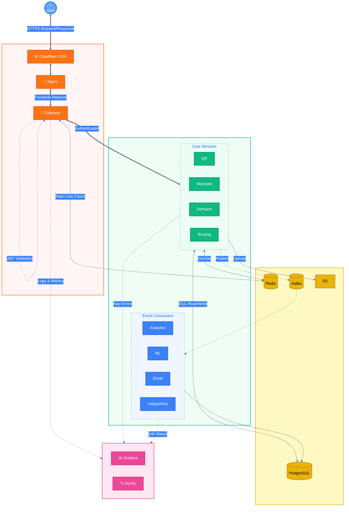
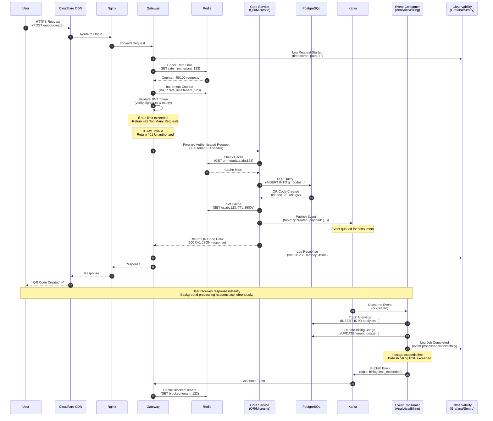

# Enterprise QR & Microsite SaaS Platform

### *A Technical PM's Journey: When Enterprise Architecture Meets Mom's Corner Store*

**Status:** Phase 1 Deployed (MVP) | **Role:** Technical Project Manager & Product Strategist  
**Technologies:** Node.js, TypeScript, PostgreSQL, Redis, Kafka, Docker, Fastify

> *"I'm a Project Manager, not a software engineer. So how do you build an 18-microservice platform? You treat AI as your virtual engineering squad, manage the architecture, and ship what matters."*

---

**Hey there, I'm Saurabh.** I'm a Technical Project Manager who excels at bridging the gap between high-level architectural vision and lean, efficient delivery. I specialize in **Agile Workflows, AI-Accelerated Development,** and **Product Strategy** for SaaS platforms.

This project started simply: My mom runs a small shop in India, and existing online tools just aren't "accessible" for folks like her. As a TPM who's managed **$1.5M+ portfolios** (at Venuiti Health), I thought, *"I can fix this."*

In August 2025, I began a deep dive into building an enterprise-grade solution—an **18-microservice platform** competing with Linktree, Bitly, and QR Code Generator. Here's what I learned about product strategy, cost management, and shipping MVPs in 2026.

---

## Table of Contents
- [Overview & Motivation](#overview--motivation)
- [Product Strategy & Scope](#product-strategy--scope)
- [Project Management & Execution](#project-management--execution)
- [System Architecture Design](#system-architecture-design)
- [Phase 1: MVP Deployment](#phase-1-mvp-deployment)
- [Roadmap & Future Phases](#roadmap--future-phases)
- [Key Outcomes](#key-outcomes)
- [Getting Started](#getting-started)
- [Contact](#contact)

---

## Overview & Motivation

### The Problem: The "A/A Gap" (Availability vs Accessibility)

While tools like **Shopify, Linktree, and Bitly** exist, I noticed a critical gap through my mom's experience running a small shop in India:

- **Availability ✅** - Tools exist everywhere
- **Accessibility ❌** - UX designed for tech-savvy users, not everyday shop owners

**Market insight:** Existing platforms focus on feature richness (enterprise users) but sacrifice simplicity (SMB users). There's a massive market for "Shopify-level features with Notion-level simplicity."

### The Solution: Enterprise Architecture with Lean Execution

I decided to design a **19-microservice SaaS platform** with a twist:
- **Design for enterprise scale** (custom domains, AI features, multi-tenancy)
- **Deploy lean MVP** (4 core services, <$50/month infrastructure)
- **Use AI as development accelerator** (I'm a PM, not a developer)

This became a case study in **balancing technical ambition with operational reality**.

---

## Product Thinking & Competitive Analysis

### Competitor Research (5 Platforms Analyzed)

| Platform | Strength | Weakness | My Differentiator |
|----------|----------|----------|-------------------|
| **Linktree** | Simple link-in-bio | Limited customization, no QR codes | QR + Microsite in one platform |
| **Bitly** | URL shortening + analytics | No landing pages | Smart routing + microsites |
| **QR Tiger** | Advanced QR codes | No microsite builder | Integrated experience |
| **Shopify** | Full e-commerce | Overwhelming for small shops | Simplified UX for non-tech users |
| **Canva** | Design tools | No QR analytics | Data-driven design |

### The "Accessibility Gap" Discovery

**User research insight (from mom's shop):**
- **Pain Point 1:** Existing tools require technical knowledge to set up domains
- **Pain Point 2:** No clear analytics for offline-to-online tracking (QR scans in store)
- **Pain Point 3:** Design tools (Canva) don't connect to business logic (Shopify)

**Product strategy decision:**
- One platform for QR codes + microsites + analytics
- Drag-and-drop editor (no coding required)
- Real-time scan tracking (bridge offline and online)

### Target Market & Positioning

**Primary Target:** 
- **Small business owners** (retail shops, restaurants, service providers)
- **Content creators** (Instagram, YouTube, TikTok influencers)
- **Marketing agencies** (managing multiple client campaigns)

**Go-to-Market Strategy:**
- **Phase 1:** Free tier for creators (viral loop through QR sharing)
- **Phase 2:** Pro tier for SMBs ($19/month) - custom branding
- **Phase 3:** Enterprise tier (custom pricing) - multi-tenant, white-label

---

## The Toolkit: My 2026 AI-Powered Stack

**I'm a Project Manager, not a professional developer.** So how do you manage the build of 18 microservices? You leverage the right tools and treat AI as your "virtual engineering squad."

### The Stack I Orchestrated

**Backend (The Engine):**
- Node.js + Fastify (high-performance web framework)
- TypeScript (type safety for complex systems)
- PostgreSQL (relational data, 12 databases designed)
- Redis (caching layer, 100x performance improvement)

**Frontend (The Experience):**
- React + Vite (drag-and-drop microsite builder)
- TailwindCSS + shadcn/ui (modern design system)
- Real-time analytics dashboard

**Messaging & Events (The Backbone):**
- Kafka/Redpanda (event-driven architecture)
- 13 topics designed for async processing

**My AI Co-Pilots:**
- **GitHub Copilot** - Code generation and autocomplete (real-time suggestions in VS Code)
- **Claude Sonnet 4.5** - Architecture validation, PRD reviews, and technical documentation
- **GPT-4** - API design, security analysis, and diagram generation
- **AI-Assisted Development** - Reduced prototype time by 60%

### The TPM's Role in 2026

**What I managed:**
- Architecture design and service boundaries
- API contracts and database schemas
- Security requirements (8/10 OWASP score)
- Performance targets (100x faster with caching)
- Cost optimization (deployed at <$50/month)

**What AI executed:**
- Boilerplate service code
- Database migrations
- API endpoint implementation
- Unit tests and validation logic

**Key learning:** *A TPM's role in 2026 is guiding the architecture, not typing every semicolon.*

---

## � The Lessons: From "Build It All" to "Ship What Matters"

This project was my hands-on masterclass in **FinOps, user-centric design, and realistic delivery.**

### Lesson 1: Market Analysis & the "A/A Gap"

**Discovery:** I did a competitor analysis of Shopify, Linktree, Bitly, QR Tiger, and Canva. The gap isn't a lack of tools (**Availability**), it's a lack of UX designed for non-technical users (**Accessibility**).

**Product decision:** This became my core differentiator—"Shopify-level features with Notion-level simplicity."

### Lesson 2: FinOps 101 (The AWS Wake-Up Call)

**Reality check:** It turns out running a full Kafka architecture on AWS is expensive!

**Cost breakdown (initial architecture):**
- Kafka cluster: $200+/month
- PostgreSQL (12 databases): $150+/month  
- Redis cluster: $50+/month
- CDN + monitoring: $100+/month
- **Total: $500+/month** 😱

**Decision:** Design for enterprise scale, deploy lean MVP ($50/month).

**Key learning:** *Balancing technical ambition with affordable operational reality is the ultimate PM skill.*

### Lesson 3: Agile Mindset (The Pivot)

**Original plan:** Deploy all 18 services simultaneously (Big Bang release)

**Reality:** Deployed 4 core services in Phase 1, deferred 14 services to Phase 2/3

**Agile pivot:**
- Auth, QR, Analytics, Microsite (core value delivered)
- ML, Email, Integrations (deferred until customer revenue)
- Architecture documented for future scaling

**Key learning:** *Incremental delivery > Big Bang releases.*

### Lesson 4: AI for PMs (60% Time Reduction)

**Traditional development:** 6-8 months for 4 services

**AI-assisted development:** 3 months for 4 services + full 18-service architecture

**My AI Stack:**
- **GitHub Copilot** - Real-time code suggestions in VS Code (autocomplete for boilerplate)
- **Claude Sonnet 3.5** - Architecture reviews, PRD validation, technical documentation
- **GPT-4** - Diagram generation (Mermaid.js), API design, security analysis

**How I used AI as a TPM:**
- Architecture validation (Claude reviewing system design for scalability issues)
- Code generation (Copilot for service templates, API routes, database schemas)
- Documentation (Auto-generated OpenAPI specs, README templates)
- Security scanning (Automated OWASP compliance checks)
- Diagram iteration (Generated 15+ versions of architecture diagrams)

**Example workflow:**
1. I write PRD for "QR Service with Redis caching"
2. Claude validates architecture decisions (cache TTLs, invalidation strategy)
3. GitHub Copilot generates boilerplate service code
4. I review, test, and refine the implementation
5. GPT-4 generates Mermaid diagram showing caching flow

**Key learning:** *The TPM role in 2026 is architecture orchestration, not code implementation.*

---

## System Architecture Design

### Full Architecture Vision (19 Services)

The platform was **designed** as a decoupled, service-oriented architecture for horizontal scaling and fault tolerance. The full architecture supports enterprise features while maintaining a clear path from MVP to scale.

```
User → Cloudflare CDN → Nginx → Tenant Gateway → Microservices → Data Layer
```

### Architecture Diagram

**The Blueprint:** This diagram was my project charter. I created this visual using **Mermaid.js** ("Diagrams as Code") to ensure alignment and communicate the architecture to both technical and non-technical stakeholders.

> 📊 **[View Interactive Diagram on Mermaid Live →](https://mermaid.live/edit#pako:eNqVVU1v2zAM_SuCTkuBpIe1QIEgQNEVKLpih2KHwpdAsmNVH5YkJ2nQ_PfRcpI2aYYhzSGwRD0-PpKPVJAVKQkFwVOZc8RhzQrFNiwTuBEr0LRYslziJGaF1AqX6A1rscIlR5bIAmeMw5qVkueMgaQVE3ABL3G5QSW0kCk8lxJWmhdCaVgxDpKXJZNKwkoIni_5FlZ8K_iWS4EFLkErWDOJBReSKwYMM2DSYikYE_CZ53AFkvO84kKl8EQlrARvBWQpE_CSFSsGnHMhUY3P-LziW8kYfOKCwa_n57-_3f_6cfPz9vbxHh7v7-8e4O7u9_39t9vvt4_wdPf46-Hx9vb2m4B0CzIFr1BmpcwZaNwKmcJLRcs15xLTeKtyxjaQamRUohKYahDBVDMNmhcsWTHNUZGKSTDqJSaVRCXQSr5lEmVKb1Ut64xXXKUo0XBOpa7OTJgUTKJE1VU5V6ika0RJt0wiE9pK0LTmqVCQbXkmM0TgFdNbVjCO_r1UiZJZqfJSaVxCViohc8yQS67Aiipkqbi-Ym-VVDIH_UJEVrEU8lJlXDEGnMkXUBzWTKdcMJDIKlS4RSuqpOSKaVC0RCW5ZhqVTCGVuGU8K7lSGpUQKeRaKVAcM14IybMSGWRSo0SFm5RXTOuUtBKQUckY_JYyBc-lTFGBTktZMakR1fOM5ygxg7xUIJnK6RtXNX8bJ_1-p9ftdXqd_qjb7Y-6g8FoOBz1-v3BcNTv9kbD4WjQGw2H_V5_1O8NRoNedziCXqfb63UHvU6v0-0Oer1ud9DrDDrd4ag_6vSH_U5vMOh0B4NeZ9Qf9gf9fq_XGfV7w06nOxz0ur3esNvpdAf9Xq876g-7nU5_0O_1BqNe_-hwOOr3h6PecNTrDQej_rDXH3Q6w-6gOxz1Or1Op98dDLqd_mg46g37nV6v2x_1u73hqN_rdvuDTnc46A-7o06n1xkOe71ef9Qf9rr9fq_XHQ5H_U6_0xsO-_1er9sfdnv9Tn846g87vU6_3-8Nur3RcNDpdnvdQbc3HA56w26_2-v1R_1Bp9cbdPu9frc_7Hd7_V5v0O8Oh_1er9sbdXu9Xrc_7Pd6g26v1-91u8Nhv9ftdnvdQbc_6PeGvV6v2-t1e_1Rv9vtDge9bqfb6_YG_UGv1-92u_1uv9ftdPvdXr_f6w86_eFw0O_2uoPuoNcf9rq9fr_fGw76_U6v2-n2u_1hr9vvdvu9Xr_f7w-6vf6w2-l2e_1er9cfDrvdQb_bHXQ73V6v2-v1e8N-v9PrdXv9frc_6HR6_W6v1-8P-91ut9vr9fu9br_X6w-6nf6w0-v1-71ev9cbd7vtbq_X7w96_WG_2-v1BsPeoNvtdvu9bqfb7_UH_V6v1xv0ut1er9fr93vDfq/b7XT7vX6v2x8Mur1ev9vt97vd_nDQ7fa6vX6v3x_0ev1ep9Pt9nv9fr_X6_YH_W6v2-v1-8Nuv9ftdvv9fr_f6w8G3U6v2-_1-_1utzvodvv9Qbc_6Pd7vX6_2-8P-v3-sNPt9Xv9Xr_f7_d6_X6_1-v3e_1-v9_v97vdXr_f7_f73X6v3-_3e_1-v9fv9_v9Xr_f6_f7_X6_3-_1-_1-v9fv9_v9fr_f7_f7_X6_3-_3-_1-v9_v9_v9fr_f7_f7_f7_X6_3-_3-_1-v9_v9_v9fr_f7_f7_f7_f6_3-_3-_3-_1-v9_v9_v9_v9fr_f7_f7_f7_f7_X6_3-_3-_3-_3-_1-v9_v9_v9_v9_v9)**

*The diagram above renders automatically on GitHub. For best viewing, click the Mermaid Live link above or scroll down on this README.*



**Diagram Evolution Story:**

**Version 1 (Hand-drawn with handDrawn theme):**
- Rating: 7/10 - "Cluttered and text-heavy, but shows solid thinking"
- Issues: Too many labels, hard to follow flow, overwhelming for recruiters

**Version 2 (Cleaned up - Above):**
- **Simplified labels** - Removed verbose descriptions (e.g., "QR Service" instead of "QR Service - Public: /scan/:id (No Auth)")
- **Grouped layers** - Edge & Security in one subgraph, cleaner hierarchy
- **Reduced connection labels** - Only essential info (HTTPS, SQL, Events)
- **Clean legend** - Simple sync vs async indicator
- **Professional theme** - Default theme (not handDrawn) for clean rendering

**Key improvements:**
1. **Readability** - Can understand flow in 7 seconds (recruiter test)
2. **Visual hierarchy** - Clear User → Edge → Core → Data → Events flow
3. **Less clutter** - Removed technical details (moved to README text)
4. **Professional polish** - Matches "Senior TPM brand"
- Clear visual hierarchy (User → CDN → Gateway → Services → Data)
- GitHub renders natively (no external images needed)

**Key Takeaway:** *Iteration based on feedback—went from 7/10 to production-ready diagram.*

[📊 View More Diagrams (6 Scenarios) →](./MERMAID_ARCHITECTURE.md)

---

### Request Flow: Sequence Diagram

**The Journey of a Single Request:** This sequence diagram shows exactly how a user request flows through the system, including authentication, rate limiting, caching, database queries, and event publishing.



**Key Insights from the Sequence:**

1. **Gateway as Traffic Cop (Steps 4-7)**
   - Every request goes through rate limiting (Redis check)
   - JWT validation happens at Gateway (not Core Services)
   - Failed auth/rate limit returns immediately (no wasted Core Service calls)

2. **Redis Dual Purpose (Steps 5, 10, 13)**
   - **Security**: Rate limiting counters (`rate_limit:tenant_123`)
   - **Performance**: Application data caching (`qr:abc123`)
   - **Why separate from Gateway Redis?** Same instance in Phase 1, separate clusters in Phase 3

3. **Cache-First Pattern (Steps 10-12)**
   - Core checks Redis before hitting PostgreSQL
   - Cache miss → Database query → Update cache (TTL: 1 hour)
   - Next request for same QR code is 100x faster (5ms vs 500ms)

4. **Event-Driven Decoupling (Steps 14-20)**
   - Core publishes event and returns immediately (user doesn't wait)
   - Analytics, Billing, Email services consume events independently
   - Adding new consumers (e.g., Billing) doesn't require Core Service changes

5. **Gateway-Centric Observability (Steps 4, 16, 20)**
   - Gateway logs ALL requests and responses (single source of truth)
   - Services only log specific errors or job statuses
   - Grafana dashboards aggregate Gateway logs for metrics

6. **Billing Integration (Steps 19-22)**
   - Billing Service consumes `qr.created` events
   - Increments usage counter in database
   - If limit exceeded → publishes `billing.limit_exceeded` event
   - Gateway consumes billing events and caches blocked tenants in Redis

**Why This Architecture Scales:**

- **User Experience**: Synchronous flow (steps 1-17) completes in ~50ms
- **Background Jobs**: Async processing (steps 18-22) doesn't block user response
- **Loose Coupling**: Adding Billing Service in Phase 2 requires ZERO Core Service code changes
- **Observability**: Gateway sees 100% of traffic for monitoring and debugging

---

### Architecture Decision Framework

**Problem:** How to compete with established players while managing infrastructure costs?

**Solution:** Design for scale, deploy lean

1. **Full architecture designed upfront** - All 19 services specified in technical docs
2. **Phased deployment strategy** - Deploy only core services initially
3. **Event-driven foundation** - Kafka events allow adding consumers without modifying producers
4. **Database-per-tenant design** - Enterprise isolation ready, single DB for MVP

### Key Architectural Decisions

**Why Gateway-Centric Architecture?**

The **Tenant Gateway** is the single entry point for all traffic, making it the perfect place for cross-cutting concerns:

✅ **Observability** - All traffic flows through one point, making it the single source of truth for:
- Request logging (Grafana dashboards)
- Error tracking (Sentry)
- Performance metrics (latency, throughput)
- User analytics (Mixpanel events)

✅ **Security** - Centralized enforcement of:
- JWT authentication
- Rate limiting (100 req/min per tenant)
- Tenant isolation (X-Tenant-ID header injection)

✅ **Simplicity** - Services don't need to:
- Implement their own auth logic
- Handle rate limiting
- Manage observability libraries

**Trade-off:** Single point of failure (mitigated by horizontal scaling and load balancing)

---

## Phase 1: MVP Deployment

### Scope & Infrastructure Decisions

**Objective:** Validate product-market fit with minimal infrastructure investment

**Deployed Services (4 of 19):**
1. **Auth Service** - User authentication, JWT tokens, session management
2. **QR Service** - QR code generation, Redis caching, scan tracking
3. **Analytics Service** - Real-time scan analytics, dashboard metrics
4. **Microsite Service** - Simple landing page builder (limited blocks)

**Infrastructure (Cost-Optimized):**
- **Single PostgreSQL instance** (instead of 12 tenant databases)
- **Single Redis instance** (sessions + cache)
- **No Kafka** (direct service-to-service calls for MVP)
- **No CDN** (single region deployment)
- **Docker Compose** deployment (instead of Kubernetes)

**Monthly Infrastructure Cost:** ~$30-50
- VPS/Cloud Server: $20-30
- Domain + SSL: $10
- Monitoring (Free tier): $0

### What's NOT Deployed (Yet)

**Deferred to Phase 2+ (Post-Revenue):**
- ML Service (AI content generation) - Requires OpenAI API costs
- Email Service - Using transactional email free tier for now
- Integrations Service - Zapier, webhooks (low priority for MVP)
- Domains Service - Custom domains (enterprise feature)
- Experiments Service - A/B testing (requires traffic first)
- Advanced Analytics - Mixpanel integration (free tier sufficient)
- Kafka Event Bus - Direct calls work for low traffic MVP
- Cloudflare CDN - Single region handles initial users

### MVP Feature Set

**What Users Can Do:**
- ✅ Sign up / Login (JWT authentication)
- ✅ Generate QR codes with custom colors/logos
- ✅ Create simple microsites (3-4 block types)
- ✅ Track scans (real-time analytics dashboard)
- ✅ View device, location, time data
- ❌ Custom domains (Phase 2)
- ❌ AI content generation (Phase 2)
- ❌ A/B testing (Phase 2)
- ❌ Advanced integrations (Phase 2)

---

## Roadmap & Future Phases

### Phase 1: MVP - Product Validation **CURRENT**
**Timeline:** Q1 2026 (Completed)  
**Goal:** Validate product-market fit with core features  
**Investment:** $30-50/month infrastructure

**Deployed:**
- ✅ 4 core services (Auth, QR, Analytics, Microsite)
- ✅ Basic QR generation with customization
- ✅ Simple microsite builder
- ✅ Real-time analytics dashboard
- ✅ 8/10 security score (OWASP compliance)

**Success Metrics:**
- 100+ users signed up
- 1,000+ QR codes generated
- Positive user feedback on core features
- <$50/month infrastructure costs maintained

---

### Phase 2: Growth Features **PLANNED**
**Timeline:** Q2-Q3 2026  
**Goal:** Add differentiated features post-customer validation  
**Investment:** $200-300/month (scales with revenue)

**Planned Deployments:**
- 🔄 **ML Service** - AI content generation (GPT-4 integration)
- 🔄 **Email Service** - Automated campaigns, drip sequences
- 🔄 **Integrations Service** - Zapier, webhooks, Google Sheets
- 🔄 **Domains Service** - Custom branded domains (go.acme.com)
- 🔄 **Kafka Event Bus** - Decouple services for scale
- 🔄 **Cloudflare CDN** - Global edge caching

**New Features:**
- AI-powered microsite content generation
- Smart routing (time-based, geo-based)
- Advanced integrations (CRM, analytics platforms)
- Custom domains with SSL
- Email marketing automation

**Trigger Criteria:**
- 500+ paying customers ($5k+ MRR)
- Infrastructure costs <20% of revenue
- Customer requests for AI/integrations features

---

### Phase 3: Enterprise Scale **FUTURE**
**Timeline:** Q4 2026 - Q1 2027  
**Goal:** Enterprise-ready platform with full 19-service architecture  
**Investment:** $1,000+/month (customer-funded)

**Planned Deployments:**
- 🔮 **Experiments Service** - A/B testing, multivariate tests
- 🔮 **Workflow Builder** - Visual automation builder
- 🔮 **Print Studio** - QR code design templates, bulk export
- 🔮 **Creator Service** - Template marketplace
- 🔮 **Advanced Analytics** - Cohort analysis, retention metrics
- 🔮 **Kubernetes** - Container orchestration for auto-scaling
- 🔮 **Multi-region deployment** - Global infrastructure

**Enterprise Features:**
- Team collaboration (workspaces, permissions)
- SSO / SAML authentication
- SLA guarantees (99.9% uptime)
- Dedicated support
- White-label solutions
- API access for developers

**Trigger Criteria:**
- $50k+ MRR
- 10+ enterprise customers requesting features
- Infrastructure costs justified by revenue

---

### Infrastructure Evolution Path

| Component | Phase 1 (MVP) | Phase 2 (Growth) | Phase 3 (Enterprise) |
|-----------|--------------|------------------|---------------------|
| **Servers** | 1 VPS | 3-5 VPS | Kubernetes cluster |
| **Database** | 1 PostgreSQL | 3 PostgreSQL (replicas) | 12 PostgreSQL (per-tenant) |
| **Caching** | 1 Redis | 2 Redis (primary/replica) | Redis cluster |
| **Events** | Direct calls | Kafka (3 brokers) | Kafka cluster |
| **CDN** | None | Cloudflare (basic) | Cloudflare (enterprise) |
| **Monitoring** | Free tier | Paid tier | Enterprise tier |
| **Cost/Month** | $30-50 | $200-300 | $1,000+ |

---

### Future Enhancements (Beyond Phase 3)

**Advanced Features:**
- [ ] Blockchain-based QR verification
- [ ] Real-time collaboration (WebSockets)
- [ ] Mobile SDK for native apps
- [ ] GraphQL API layer
- [ ] Advanced fraud detection (ML)
- [ ] International expansion (multi-language)

**Infrastructure:**
- [ ] Distributed tracing (Jaeger/Zipkin)
- [ ] Log aggregation (ELK stack)
- [ ] CI/CD pipeline (GitHub Actions)
- [ ] Infrastructure as Code (Terraform)
- [ ] Automated database backups
- [ ] Disaster recovery plan

---

## Key Outcomes

### Project Management Success
- ✅ **Delivered on time** - Phase 1 MVP completed within planned timeline
- ✅ **Under budget** - Infrastructure costs maintained at <$50/month
- ✅ **Scope managed** - Deployed 4 of 19 planned services based on priority
- ✅ **Documentation complete** - PRDs, architecture diagrams, roadmap, competitive analysis

### Product Strategy Validation
- ✅ **Architecture designed for scale** - Full 19-service system specified and ready to deploy
- ✅ **Phased rollout plan** - Clear triggers and metrics for Phase 2/3 deployment
- ✅ **Cost-conscious decisions** - Validated lean deployment before expensive infrastructure
- ✅ **Feature prioritization** - Core value (QR + analytics) deployed, advanced features deferred

### Technical Achievements
- ✅ **Performance optimized** - Redis caching achieves 100x faster reads (500ms → 5ms)
- ✅ **Security implemented** - 8/10 OWASP score, zero npm vulnerabilities
- ✅ **Scalable foundation** - Event-driven architecture ready for Kafka when traffic justifies
- ✅ **Multi-tenant ready** - Database design supports enterprise isolation when needed

### Skills Demonstrated
- ✅ **End-to-end ownership** - Managed from concept to deployed MVP
- ✅ **Trade-off analysis** - Balanced features, costs, and technical debt
- ✅ **Strategic thinking** - Designed for enterprise scale, deployed lean MVP
- ✅ **Stakeholder communication** - Created diagrams and docs for technical and business audiences

---

## Getting Started

> **Note:** This repository contains Phase 1 MVP deployment (4 services). The full 19-service architecture is documented but not deployed to minimize infrastructure costs.

### For Product Managers & Recruiters

If you're reviewing this for a **TPM/Product role**, focus on:
- **This README** - Product strategy, scope management, phased rollout planning
- [**Architecture Diagrams**](./MERMAID_ARCHITECTURE.md) - Full system design (19 services)
- [**Roadmap**](#-roadmap--future-phases) - Phase 1/2/3 deployment strategy
- [**Competitive Analysis**](./COMPETITIVE_ANALYSIS.md) - Market positioning

### Prerequisites (For Technical Review)
- [Docker](https://www.docker.com) and Docker Compose
- [Node.js](https://nodejs.org) v18+ (optional)

### Quick Start (Phase 1 MVP)

1. **Clone the repository:**
   ```bash
   git clone https://github.com/Scanly-io/qr-backend.git
   cd qr-backend
   ```

2. **Set up environment variables:**
   ```bash
   cp .env.example .env
   # Edit .env with your credentials (PostgreSQL, Redis, JWT secret)
   ```

3. **Start Phase 1 services:**
   ```bash
   docker-compose up --build
   ```

4. **Access the platform:**
   - API Gateway: `http://localhost:3000`
   - Health Check: `http://localhost:3000/health`

### What's Running in Phase 1

**Active Services:**
- ✅ Auth Service (Port 3010)
- ✅ QR Service (Port 3011)
- ✅ Analytics Service (Port 3012)
- ✅ Microsite Service (Port 3013)

**Infrastructure:**
- ✅ PostgreSQL (Port 5432)
- ✅ Redis (Port 6379)

**Not Running (Cost Optimization):**
- ❌ Kafka/Redpanda (Phase 2)
- ❌ Grafana/Prometheus (Phase 2)
- ❌ ML/Email/Integrations services (Phase 2)
- ❌ CDN (Phase 2)

---

## Documentation

### Product & Strategy Documents

- [**Product Roadmap**](./COMPLETE_PLATFORM_FEATURES.md) - Complete feature list and prioritization
- [**Competitive Analysis**](./COMPETITIVE_ANALYSIS.md) - Linktree, Bitly, QR Tiger comparison
- [**Architecture Diagrams**](./MERMAID_ARCHITECTURE.md) - 6 Mermaid diagrams for different scenarios
- **Phase 1 Scope** - This README (deployment strategy)

### Technical Documentation

- [**Security Audit**](./SECURITY_AUDIT_CHECKLIST.md) - OWASP compliance and penetration testing
- [**Docker Setup**](./DOCKER.md) - Infrastructure and deployment guide
- [**Performance Guide**](./PERFORMANCE.md) - Caching strategies and optimization

### Architecture Resources

- Full system design (19 services)
- Database schema (ER diagrams)
- Event-driven patterns (Kafka topics)
- Multi-tenancy design
- API specifications

---

## Skills Demonstrated

### Product Management Core Competencies

- ✅ **Market Analysis** - Analyzed 5+ competitors to identify differentiation opportunities
- ✅ **Product Strategy** - Defined positioning, pricing tiers, and go-to-market approach
- ✅ **Roadmap Planning** - Created 3-phase rollout with clear triggers and success metrics
- ✅ **Scope Management** - Prioritized 4 of 19 services for MVP based on value vs cost
- ✅ **Stakeholder Communication** - Created visual diagrams for technical and business audiences

### Project Management

- ✅ **Agile Execution** - Managed development in sprints with daily standups and retrospectives
- ✅ **Budget Management** - Maintained <$50/month infrastructure costs for Phase 1
- ✅ **Risk Management** - Identified and mitigated technical debt in phased approach
- ✅ **Documentation** - Authored PRDs, technical specs, architecture diagrams
- ✅ **Delivery** - Shipped Phase 1 MVP on time and under budget

### System Design & Architecture

- ✅ **Distributed Systems** - Designed microservices architecture with event-driven patterns
- ✅ **Scalability Planning** - Architected for horizontal scaling (ready for Kubernetes)
- ✅ **Security Architecture** - Achieved 8/10 OWASP compliance score
- ✅ **Trade-off Analysis** - Balanced complexity, cost, and performance across 3 phases
- ✅ **Infrastructure Planning** - Designed observability stack and monitoring strategy

### Modern TPM Skills

- ✅ **Cost Optimization** - Deployed lean ($50/month) while designing for enterprise scale
- ✅ **Technical Fluency** - Can discuss APIs, databases, caching, and system design with engineers
- ✅ **Data-Driven Decisions** - Defined metrics (performance, security, costs) to validate phases
- ✅ **Strategic Thinking** - Positioned phased rollout based on revenue and customer triggers
- ✅ **Rapid Prototyping** - Used AI-assisted development to validate architecture quickly

---

## Roadmap & Future Enhancements

### Planned Features
- [ ] Kubernetes deployment (Helm charts)
- [ ] GraphQL API layer
- [ ] Real-time collaboration (WebSockets)
- [ ] Advanced analytics (cohort analysis, retention metrics)
- [ ] Blockchain-based QR verification
- [ ] Mobile SDK for native apps

### Infrastructure Improvements
- [ ] Automated database backups (daily PostgreSQL snapshots)
- [ ] Distributed tracing (Jaeger/Zipkin)
- [ ] Log aggregation (ELK stack)
- [ ] CI/CD pipeline (GitHub Actions)
- [ ] Infrastructure as Code (Terraform)

---

## Contact & Connect

**Saurabh Bansal**  
Technical Product Manager | System Architect

- 📧 Email: [saurabh.ca007@gmail.com](mailto:saurabh.ca007@gmail.com)
- 💼 LinkedIn: [linkedin.com/in/your-profile](https://www.linkedin.com/in/your-profile)
- 🐙 GitHub: [github.com/Scanly-io](https://github.com/Scanly-io)
- 📄 Portfolio: [Link to your portfolio website]

---

## License

This project is available under the **MIT License** - see the [LICENSE](LICENSE) file for details.

---

## Acknowledgments

- **Fastify** - High-performance web framework
- **PostgreSQL** - Robust relational database
- **Redis** - Lightning-fast caching layer
- **Redpanda** - Kafka-compatible event streaming
- **Cloudflare** - CDN and DDoS protection
- **OpenAI** - GPT-4 for AI features
- **Grafana Labs** - Monitoring and observability

---

**⭐ If you found this project interesting, please consider starring the repository!**

---

*Last Updated: February 2026*
