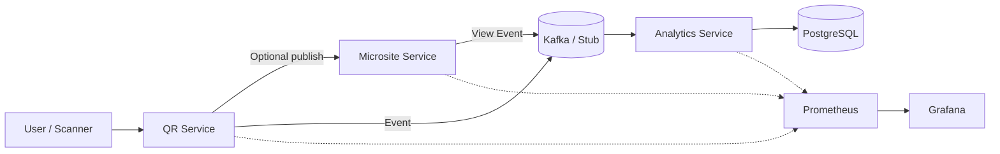

# QR Backend Monorepo

Microservices for QR code generation, microsite publishing, authentication, and real-time analytics with resilient infrastructure and shared common utilities.

---

## � Contents

- [Overview](#overview)
- [Architecture & Flow](#architecture--flow)
- [Services](#services)
- [Project Structure](#project-structure)
- [Getting Started](#getting-started)
- [Environment Variables](#environment-variables)
- [Common Tasks](#common-tasks)
- [Troubleshooting](#troubleshooting)
- [Observability](#observability)
- [Contributing](#contributing)
- [Cross-links](#cross-links)

---

## Overview

Core ideas:
- Decoupled services: Auth, QR, Microsite, Analytics (+ DLQ Processor).
- Kafka (optional) for event streaming with graceful stubs when disabled.
- Redis for microsite HTML caching (MISS → HIT flow).
- PostgreSQL per service for isolation (Drizzle ORM).
- Central environment variable guide in `ENVIRONMENT.md`.

When a QR is scanned → QR Service handles it (or renders a microsite link) → events flow to Kafka → Analytics consumes and stores → dashboards & metrics exposed via Prometheus/Grafana.

---

## Architecture & Flow



---

## Services

| Service | Port | Purpose | Swagger |
|---------|------|---------|---------|
| Auth Service | 3001 | User signup/login, issues JWT | /docs |
| QR Service | 3002 | QR image generation & (future) scan ingest | /docs |
| Microsite Service | 3005 | Publish & serve cached microsite HTML | /docs |
| Analytics Service | 3004 | Consume events & persist scan/view analytics | /docs |
| DLQ Processor | (dynamic) | Handle dead-letter events (future) | N/A |

Microsite publish requires JWT (Bearer). Public viewing is anonymous.

---

## Project Structure

```text
qr-backend/
  packages/
    common/                # Shared utilities (Kafka wrapper, auth, cache, etc.)
  services/
    auth-service/          # Signup/login → JWT
    qr-service/            # QR code + image endpoint
    microsite-service/     # Publish & render microsites
    analytics-service/     # Event consumer & persistence
    dlq-processor/         # (Placeholder for failed event handling)
  monitoring/              # Prometheus + Grafana config
  ENVIRONMENT.md           # Central env variable reference
  CHANGES_SUMMARY.md       # Session change log
  docker-compose.yml       # Infra stack
```

---

## Getting Started

### Prerequisites
- Docker
- Node.js 18+
- PostgreSQL, Redis (optionally via docker-compose)

### Install & Run
```bash
git clone <repo-url>
cd qr-backend
npm install
docker-compose up -d        # postgres, redis, redpanda, prometheus, grafana

# Prepare schemas (example for analytics)
cd services/analytics-service
npx drizzle-kit push
cd ../..

# Core services only (QR + Analytics)
npm run dev

# All services (adds auth, microsite, dlq-processor)
npm run dev:all
```

### Verify
```bash
curl -s http://localhost:3002/health
curl -s http://localhost:3004/health
curl -s http://localhost:3005/health || true
```

Swagger UIs: `http://localhost:<port>/docs` (JWT Authorize button for secured endpoints).

---

## Environment Variables

Use per-service `.env` files. Minimal examples:
```env
# auth-service
DATABASE_URL=postgres://user@localhost:5432/auth_service
JWT_SECRET=devsecret

# microsite-service
DATABASE_URL=postgres://user@localhost:5432/microsite_service
JWT_SECRET=devsecret
KAFKA_DISABLED=1
REDIS_URL=redis://localhost:6379

# qr-service
DATABASE_URL=postgres://user@localhost:5432/qr_service

# analytics-service
DATABASE_URL=postgres://user@localhost:5432/qr_analytics
KAFKA_DISABLED=1
```

Full reference (defaults, optional vs required): see `ENVIRONMENT.md`.

---

## Common Tasks

```bash
# Show latest microsite cache header
curl -i http://localhost:3005/public/test-qr-123 | grep -i x-cache

# View QR image binary identification
curl -s http://localhost:3002/qr/test-qr-123/image -o /tmp/t.png && file /tmp/t.png

# Kill stray dev ports
lsof -ti:3001,3002,3004,3005 | xargs kill -9 2>/dev/null || true

# DB sample query
psql -U <user> -d qr_analytics -c "SELECT qr_id, target_url FROM qrs LIMIT 5;" || true
```

---

## Troubleshooting

| Symptom | Likely Cause | Quick Fix |
|---------|--------------|-----------|
| 401 Invalid token | Missing `JWT_SECRET` early import | Ensure `import "dotenv/config";` first in entry file |
| Kafka timeout logs | Broker not running / disabled | Set `KAFKA_DISABLED=1` or start Redpanda |
| Microsite 403 publish | JWT `sub` ≠ `createdBy` | Use token from creator account |
| Always MISS cache | Redis not running | Start Redis container |
| Port in use | Stale dev process | Kill with `lsof -ti:<port> | xargs kill -9` |

More: `CHANGES_SUMMARY.md` and service-specific READMEs.

---

## Observability

Prometheus scrape endpoints: `/metrics` on each service.
Grafana login: `admin / admin`. Add panels for latency, error rate, cache HIT ratio.

Recommended PromQL:
```promql
rate(http_requests_total[5m])
histogram_quantile(0.95, rate(http_request_duration_seconds_bucket[5m]))
```

---

## Contributing

1. Branch from `main`
2. Make focused change (code + docs)
3. Add/adjust comments where logic is non-obvious
4. Run relevant services locally (`npm run dev:all` if cross-service)
5. Update `CHANGES_SUMMARY.md` (if notable) & link docs
6. Open PR

Coding style: prefer small shared utilities in `packages/common`. Keep service boundaries clear.

---

## Cross-links

- Environment variables: `ENVIRONMENT.md`
- Microsite details: `services/microsite-service/README.md`
- Change log: `CHANGES_SUMMARY.md`
- Auth workflow: `services/auth-service/README.md`

---

**Last Updated:** November 22, 2025
