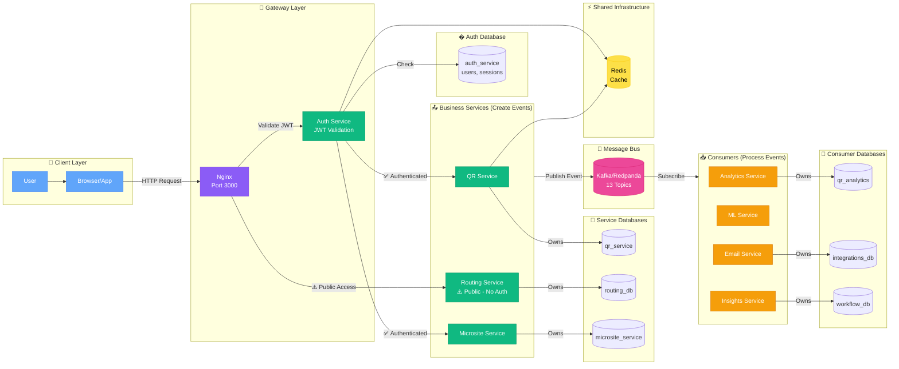
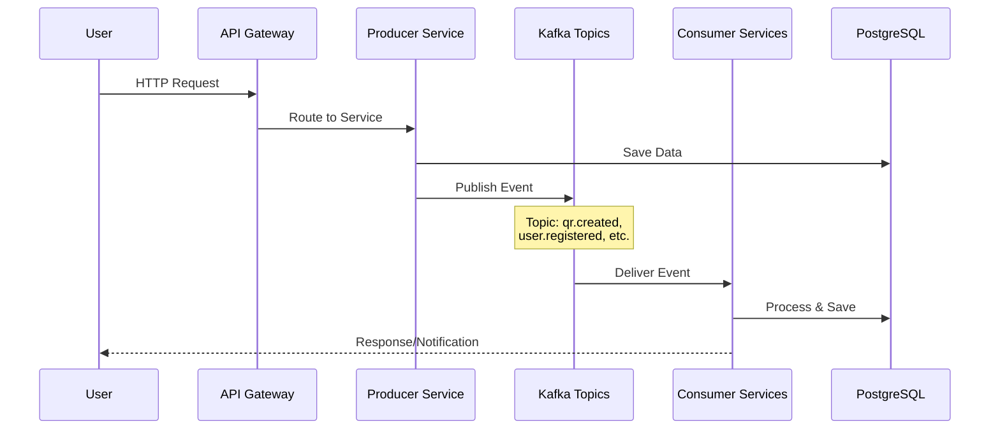
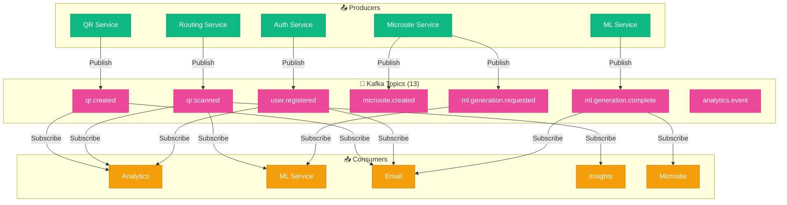

# 🔄 Request Flow: Producer-Consumer Pattern

**Simple visualization of how requests flow through the system**

---

## 📊 Producer → Kafka → Consumer Flow



---

## 📊 Detailed Event Flow with Topics



---

## 📋 Event Topics & Handlers



---

## 🎯 Key Patterns

### **Synchronous (Request-Response)**
```
User → Gateway → Service → Database → Response
```
- Used for: Authentication, QR creation, Page fetching
- Latency: < 200ms

### **Asynchronous (Event-Driven)**
```
Service → Kafka Topic → Consumer Services
```
- Used for: Analytics, Email notifications, ML processing
- Decouples services, improves reliability

### **Pub/Sub Pattern**
```
1 Producer → 1 Topic → Multiple Consumers
```
Example: `qr.scanned` event consumed by Analytics, ML, and Insights

---

## 💡 Benefits

✅ **Loose Coupling** - Services don't need to know about each other  
✅ **Scalability** - Add more consumers to handle load  
✅ **Reliability** - Messages persisted in Kafka  
✅ **Async Processing** - Don't block user requests  
✅ **Event Sourcing** - Full audit trail of all events
